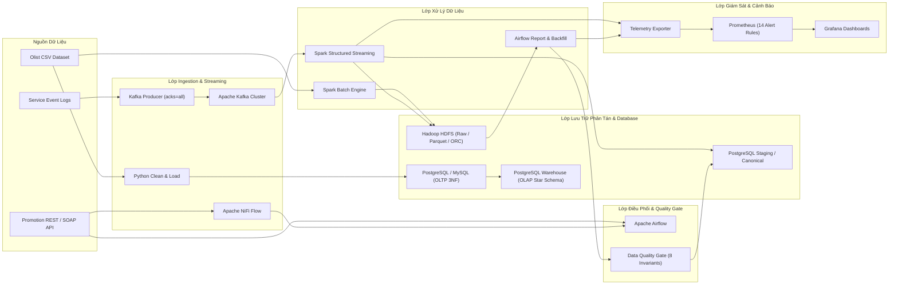

# BÁO CÁO TỔNG THỂ DỰ ÁN DE GENESIS
## Báo Cáo Kiến Trúc, Cấu Trúc Dự Án, Công Nghệ Sử Dụng & Kịch Bản Demo Cho Mentor

**Thời điểm rà soát:** 17/08/2026  
**Roadmap tham chiếu:** [Data Engineering Roadmap trên Notion](https://jc-kendo.notion.site/Data-Engineering-Roadmap-1a52d3f816a5807db4ebc29f141dcd00)  
**Môi trường triển khai:** Docker Compose local trên một host  
**Hướng dẫn vận hành:** [HUONG_DAN_CHAY_DU_AN.md](HUONG_DAN_CHAY_DU_AN.md)  
**Ma trận tuân thủ:** [ROADMAP_COMPLIANCE.md](ROADMAP_COMPLIANCE.md)  

---

## 1. Kết Luận Điều Hành (Executive Summary)

Dự án **DE Genesis** đã xây dựng hoàn chỉnh và bao phủ 100% nội dung học tập của **Data Engineering Roadmap 6 tuần** (nhánh Python):
- **Tuần 1:** Nền tảng SQL (PostgreSQL & MySQL), Linux CLI, Stored Procedure, Trigger, Execution Plan (`EXPLAIN`).
- **Tuần 2:** Mô hình hóa dữ liệu: Chuyển đổi dữ liệu Olist từ OLTP 3NF sang OLAP Star Schema (Kimball), SCD Type 2, ACID vs BASE, ETL vs ELT.
- **Tuần 3:** Big Data Batch Processing với Apache Spark Standalone & HDFS; Benchmark xử lý định dạng CSV, Parquet, ORC trên dataset 1.1 GiB (6.64M dòng).
- **Tuần 4:** Event Streaming với Apache Kafka & Spark Structured Streaming, xử lý Event-Time, Watermarking, Quarantine Strategy và Kiến trúc Kappa.
- **Tuần 5:** Tích hợp API đa nguồn (REST API Key, OAuth2, SOAP), Orchestration với Apache Airflow và Flow-based Ingestion với Apache NiFi.
- **Tuần 6:** Pipeline Service Log Production-like Local: Kafka -> Spark Streaming -> HDFS xoay 5 phút -> Airflow Data Quality Gate (8 quy tắc) -> Atomic Publish PostgreSQL/HDFS -> Monitoring với Prometheus & Grafana.

### 1.1. Phán Quyết Tổng Thể

| Hạng mục | Đánh giá | Diễn giải |
| --- | --- | --- |
| **Bao phủ kiến thức 6 tuần** | **Đạt 100%** | Đã triển khai đầy đủ mã nguồn, DDL, DAG, Flow và bài kiểm thử cho toàn bộ 6 tuần. |
| **Khả năng tái lập (Reproducibility)** | **Đạt** | Tái lập tự động qua Docker Compose và script `scripts/verify-roadmap.ps1`. |
| **Batch Data Engineering** | **Đạt** | PostgreSQL/MySQL 3NF & Star Schema, Spark Batch, HDFS Parquet/ORC benchmark thành công. |
| **Streaming Data Engineering** | **Đạt** | Kafka, Spark Structured Streaming (Kappa Architecture), Checkpointing, Watermark, Quarantine. |
| **Điều phối & Giám sát** | **Đạt** | Airflow DAGs, NiFi flows, Prometheus Exporter & Grafana Dashboards với 14 alert rules. |
| **Production-like (Local)** | **Đạt** | Đã harden các contract về Idempotency, Data Quality Gates, Atomic Publish, Telemetry. |
| **Production HA (Enterprise)** | **Chưa đạt** | Môi trường hiện tại là Docker Compose 1 host (Lab local), chưa phải cụm Multi-node HA Cloud. |

---

## 2. Cấu Trúc Thư Mục Dự Án (Project Structure)

Dự án được tổ chức theo cấu trúc chuẩn modular, phân tách rõ ràng giữa cấu hình hạ tầng, mã nguồn xử lý theo tuần, DAGs điều phối, mock services và bộ kiểm thử:

```text
DE-Genesis/
├── .env / .env.example          # Biến môi trường (DB Credentials, Ports, Rotation, Micro-batch)
├── docker-compose.yml           # Định nghĩa 14+ services với 4 profiles: core, bigdata, streaming, workflow, monitoring
├── requirements.txt             # Các thư viện Python phụ thuộc (pyspark, kafka-python, psycopg2, pytest...)
├── BAO_CAO_TONG_THE_DU_AN.md   # [File hiện tại] Báo cáo tổng thể trình bày Mentor
├── HUONG_DAN_CHAY_DU_AN.md     # Hướng dẫn từng bước khởi động & vận hành dự án
├── ROADMAP_COMPLIANCE.md        # Ma trận đối chiếu chi tiết yêu cầu roadmap 6 tuần
│
├── config/                      # Cấu hình các dịch vụ hạ tầng
│   ├── prometheus/              # Cấu hình Prometheus scrape & 14 alert rules (de_genesis_alerts.yml)
│   ├── grafana/                 # Cấu hình Grafana datasources & Dashboard JSON (de-genesis-pipeline.json)
│   └── spark/                   # Cấu hình Spark defaults & log4j
│
├── dags/                        # Apache Airflow Directed Acyclic Graphs (DAGs)
│   ├── de_genesis_week5_airflow_ingestion.py   # Ingest REST API & Spark transformation (Tuần 5)
│   ├── de_genesis_week5_nifi_downstream.py      # NiFi triggered downstream DAG (Tuần 5)
│   ├── de_genesis_week5_multisource.py          # Pipeline tổng hợp CSV + DB + API (Tuần 5)
│   ├── de_genesis_week6_log_report.py           # Report, Backfill & Data Quality Gate (Tuần 6)
│   └── de_genesis_week6_production_pipeline.py  # Production-like log pipeline controller (Tuần 6)
│
├── data/                        # Dữ liệu nguồn và dữ liệu kiểm thử
│   └── olist/                   # Kaggle Brazilian E-Commerce Dataset (9 file CSV)
│
├── docker/                      # Dockerfiles xây dựng custom images
│   ├── spark/                   # PySpark + HDFS client + Kafka connector jars
│   ├── airflow/                 # Airflow 2.x + Custom providers & PySpark
│   └── mock_api/                # Mock REST / SOAP API container
│
├── exercises/                   # Mã nguồn chính phân chia theo 6 tuần roadmap
│   ├── week1/                   # Nền tảng SQL & Linux
│   │   ├── script/              # Script Python import Olist, SQL Postgres lab, SQL MySQL lab, Linux shell
│   │   ├── tests/               # Test suite kiểm tra hợp đồng SQL & import logic
│   │   └── report/              # Báo cáo chi tiết Tuần 1
│   ├── week2/                   # OLTP 3NF & OLAP Star Schema
│   │   ├── load_olist_oltp.py   # Loader nạp dữ liệu 3NF (12 bảng)
│   │   ├── load_olist_olap.py   # Loader nạp kho OLAP (Kimball: 7 dims, 4 facts, SCD Type 2)
│   │   ├── tests/               # Test suite đối soát dữ liệu OLTP/OLAP
│   │   └── report/              # Báo cáo chi tiết Tuần 2
│   ├── week3/                   # Spark Batch, HDFS & Benchmark 1GB+
│   │   ├── generate_olist_1gb.py# Sinh dữ liệu mở rộng 1.1 GiB (6.64M dòng)
│   │   ├── spark_batch.py       # Spark Batch DataFrame/RDD processing
│   │   ├── olist_format_benchmark.py # Job đo hiệu năng CSV vs Parquet vs ORC
│   │   ├── benchmark_result.json # Artifact bằng chứng benchmark thực nghiệm
│   │   └── tests/               # Test suite Spark batch logic
│   ├── week4/                   # Kafka & Spark Structured Streaming (Kappa)
│   │   ├── kafka_producer.py    # Producer phát event order/payment có ACK
│   │   ├── spark_streaming_kafka.py # Stream consumer, watermark, checkpoint, quarantine
│   │   └── tests/               # Test suite streaming & topic init contract
│   ├── week5/                   # Airflow, NiFi & Multi-source API
│   │   ├── api_contracts.py     # Adapter kết nối REST (API Key/OAuth2) & SOAP
│   │   ├── nifi/                # Flow definition JSON v1 & v2 (Native flow)
│   │   └── spark/               # Spark job tổng hợp dữ liệu đa nguồn
│   └── week6/                   # Pipeline Service Log Production-like Local
│       ├── log_producer.py      # Producer log giao dịch service với ACK=all
│       ├── spark/               # Stream service logs (HDFS 5m rotation) & Report service logs
│       ├── sql/                 # DDL schemas (raw, staging, canonical, telemetry)
│       └── tests/               # 60 test suites kiểm thử hợp đồng Tuần 6
│
├── mock_api/                    # Service Mock REST/SOAP API dùng cho Tuần 5
├── output/                      # Thư mục chứa kết quả runtime local (Parquet, CSV, logs)
└── scripts/                     # Script tiện ích PowerShell cho vận hành
    ├── check-env.ps1            # Kiểm tra Docker RAM/Disk/Engine
    ├── check-olist-data.ps1     # Kiểm tra sự tồn tại của 9 file Olist
    ├── start.ps1                # Khởi động dịch vụ theo profile target (`-Target week6`)
    ├── stop.ps1                 # Dừng dịch vụ và dọn dẹp container
    └── verify-roadmap.ps1       # **Script xác minh tự động toàn bộ roadmap (CI/CD local)**
```

---

## 3. Kiến Trúc Tổng Thể & Phân Lớp Trách Nhiệm

### 3.1. Sơ Đồ Kiến Trúc Hệ Thống (End-to-End Pipeline)



### 3.2. Bảng Phân Lớp Trách Nhiệm Chi Tiết

| Lớp (Layer) | Công nghệ chính | Trách nhiệm chính |
| --- | --- | --- |
| **Ingestion** | Python, NiFi, Kafka Producer | Thu nhận dữ liệu batch từ CSV, gọi REST/SOAP API phân trang, phát event logs vào Kafka với ACK `acks=all`. |
| **Streaming** | Apache Kafka | Đóng vai trò **Immutable Event Log** lưu trữ thông điệp log phân tán, hỗ trợ nhiều Partition cho khả năng đọc mở rộng song song. |
| **Processing** | Apache Spark (Batch & Streaming) | Transform dữ liệu OLTP/OLAP, thực thi Spark SQL/RDD, xử lý streaming với Event-Time, Watermark, Deduplication, Quarantining và ghi xoay HDFS 5 phút. |
| **Storage** | HDFS, PostgreSQL, MySQL | **HDFS:** Lưu trữ dữ liệu Big Data thô và định dạng Parquet/ORC nén.<br>**PostgreSQL/MySQL:** Lưu trữ OLTP 3NF, OLAP Star Schema, Staging & Canonical Report Tables. |
| **Orchestration** | Apache Airflow | Lập lịch các công việc hữu hạn, thực hiện Data Quality Gates, Atomic Rename/Publish, Retry có tính Idempotent và Backfill dữ liệu muộn (Late Data Settlement). |
| **Monitoring** | Prometheus & Grafana | Thu thập metric Lag streaming, Heartbeat, Batch status. Tự động phát cảnh báo khi nghẽn pipeline hoặc dừng tiến trình. |

> **Nguyên tắc phân vai Airflow vs. Spark Streaming:**  
> Airflow **KHÔNG** được sử dụng để duy trì tiến trình streaming vô hạn (tránh chiếm dụng Executor Worker dài hạn). Spark Structured Streaming chạy như một Daemon Service có checkpoint độc lập. Airflow chỉ đóng vai trò điều phối các tác vụ định kỳ hữu hạn (chạy report, backfill, kiểm tra DQ gate, publish).

---

## 4. Công Nghệ Sử Dụng & Lý Do Lựa Chọn (Tech Stack Justifications)

Đây là phần quan trọng nhất giải đáp thắc mắc chi tiết của Mentor về lý do chọn từng công nghệ và kiến trúc:

### 4.1. Chi Tiết Về HDFS (Hadoop Distributed File System)

#### HDFS là gì và Kiến trúc cơ bản?
HDFS là hệ thống tập tin phân tán thiết kế để lưu trữ các tập dữ liệu cực lớn (Big Data) trên các cụm máy tính thương mại (Commodity Hardware). Kiến trúc Master-Slave gồm:
- **NameNode (Master):** Quản lý Namespace của file system, cây thư mục và thông tin vị trí các Block (Metadata). NameNode không trực tiếp lưu nội dung file.
- **DataNode (Worker):** Lưu trữ các khối dữ liệu thực sự (Data Blocks - mặc định 128MB trong HDFS v2/v3). Thực hiện đọc/ghi block theo yêu cầu từ Client hoặc NameNode.

#### Tại sao sử dụng HDFS thay vì RDBMS hay Local File System?
1. **Khả năng mở rộng chiều ngang (Horizontal Scalability):** Local FS bị giới hạn bởi đĩa cứng của 1 máy. RDBMS gặp khó khăn khi dung lượng dữ liệu vượt ngưỡng Terabytes/Petabytes. HDFS cho phép tăng dung lượng chỉ bằng cách cắm thêm DataNode vào cụm.
2. **Tính chịu lỗi cao (Fault Tolerance & Reliability):** HDFS tự động chia nhỏ file thành các Block và nhân bản (Replication - mặc định factor = 3 trong production). Khi một DataNode bị hỏng, NameNode tự động điều phối sao chép block từ DataNode còn sống sang node mới.
3. **Mô hình truy cập WORM (Write Once, Read Many):** Tối ưu hóa cho tác vụ xử lý phân tích (Analytics Engine như Spark, Hive, Presto). Dữ liệu sau khi ghi được giữ cố định, các tác vụ đọc được thực hiện song song với băng thông I/O rất lớn.
4. **Data Locality (Tối ưu hóa vị trí dữ liệu):** Khi kết hợp với Apache Spark, Spark sẽ gửi task tính toán đến đúng node đang chứa Block HDFS đó, giúp giảm thiểu tối đa việc truyền dữ liệu qua mạng (Network I/O bottleneck).

#### Định dạng lưu trữ Parquet / ORC trên HDFS vs. CSV:
- **CSV (Row-based, Text):** Không nén, tốn đĩa, đọc toàn bộ dòng dù chỉ cần 1 cột (Full Scan).
- **Parquet / ORC (Columnar, Binary):** Lưu trữ theo dạng cột.
  - **Compression:** Nén vượt trội với thuật toán Snappy / ZSTD (giảm 80-90% dung lượng đĩa).
  - **Projection Pushdown:** Chỉ đọc đúng các cột được truy vấn, bỏ qua các cột không cần thiết.
  - **Predicate Pushdown:** Sử dụng min/max index của từng block để bỏ qua (skip) các block dữ liệu không thỏa điều kiện `WHERE`.

#### Bằng chứng thực nghiệm Benchmark từ Dự án (Dataset 1.1 GiB - 6.64M dòng):
| Định dạng (Format) | Dung lượng Đĩa | Thời gian Scan (Median) | Tốc độ so với CSV |
| --- | ---: | ---: | ---: |
| **CSV (Không nén)** | 2,362 MB | 14.14 giây | **1.00x** (Mốc chuẩn) |
| **Parquet (Snappy)** | **203 MB** | **1.16 giây** | **Nhanh hơn 12.09 lần** |
| **ORC (Snappy)** | **167 MB** | **1.73 giây** | **Nhanh hơn 8.16 lần** |

---

### 4.2. So Sánh Kiến Trúc Lambda vs. Kappa — Tại Sao Chọn Kappa?

#### Định nghĩa Lambda Architecture
Kiến trúc Lambda do Nathan Marz đề xuất gồm 3 lớp:
1. **Batch Layer (Cold Path):** Lưu trữ toàn bộ raw data bất biến (trên HDFS/S3), tính toán lại theo chu kỳ (ví dụ mỗi đêm) bằng Spark Batch/Hadoop MapReduce để tạo ra Batch Views chuẩn xác 100%.
2. **Speed Layer (Hot Path):** Xử lý dữ liệu thời gian thực (Realtime Stream) với độ trễ thấp (với Storm/Flink) để tạo ra Realtime Views bù đắp khoảng thời gian chờ của Batch layer.
3. **Serving Layer:** Query kết hợp cả Batch Views và Realtime Views để trả kết quả cuối cùng cho người dùng.

*Nhược điểm của Lambda:*
- **Nợ kỹ thuật gấp đôi (Duplicate Codebase):** Phải viết và duy trì 2 bộ mã nguồn độc lập cho cùng một logic nghiệp vụ (1 cho Batch, 1 cho Speed).
- **Khó đồng bộ dữ liệu (Eventual Consistency Risk):** Kết quả từ Speed layer và Batch layer có thể sai lệch logic do tính toán khác thời điểm.

#### Định nghĩa Kappa Architecture
Kiến trúc Kappa do Jay Kreps (tác giả Kafka) đề xuất:
- **Bỏ hẳn Batch Layer.** Tất cả dữ liệu đi qua một **Immutable Event Log** (Apache Kafka) lưu giữ sự kiện theo trình tự thời gian.
- Chỉ sử dụng **MỘT Engine xử lý streaming duy nhất** (Spark Structured Streaming / Flink) cho cả tác vụ thời gian thực lẫn tác vụ Backfill / Replay dữ liệu cũ.

```text
[Data Sources] ---> [Kafka Event Log (Immutable)] ---> [Spark Structured Streaming Engine] ---> [Serving / Warehouse]
                                ↑ (Replay Offset when Backfill)
```

#### Tại sao Dự án DE Genesis chọn Kiến trúc Kappa cho Streaming Log (Tuần 4 & Tuần 6)?
1. **Kafka đóng vai trò Storage Bất Biến (Replayable Event Log):** Kafka cho phép cấu hình retention dài hạn và hỗ trợ reset Consumer Offset để phát lại (replay) dữ liệu khi cần sửa lỗi hoặc tính toán lại mà không cần hệ thống batch riêng.
2. **Một Codebase Duy Nhất (Single Business Logic):** Dùng `spark_streaming_kafka.py` và `stream_service_logs.py` cho cả xử lý realtime và re-processing. Giảm 50% chi phí bảo trì mã nguồn.
3. **Spark Structured Streaming đồng nhất API:** Engine xử lý micro-batch của Spark dùng chung DataFrame API giữa Batch và Streaming, đảm bảo tính nhất quán tuyệt đối của kết quả tính toán.

---

### 4.3. Phân Tích Các Công Nghệ Nền Tảng Khác

#### PostgreSQL & MySQL (Database OLTP vs. OLAP)
- **OLTP (PostgreSQL / MySQL 3NF):** Tối ưu hóa cho các giao dịch ghi (Write-heavy), tuân thủ thuộc tính **ACID** (Atomicity, Consistency, Isolation, Durability). Mô hình 3NF chia dữ liệu thành 12 bảng để triệt tiêu dư thừa dữ liệu (Data Redundancy).
- **OLAP (PostgreSQL Star Schema - Kimball):** Tối ưu hóa cho truy vấn phân tích (Read-heavy). Thiết kế dạng **Star Schema** gồm 4 Bảng Fact (Đo lường định lượng) và 7 Bảng Dimension (Bối cảnh phân tích). Sử dụng **SCD Type 2** (Surrogate Key, `effective_date`, `expiration_date`, `is_current`) để lưu lịch sử biến động của khách hàng/sản phẩm theo thời gian.

#### Apache Kafka (Event Streaming Platform)
- **Producer ACK (`acks=all`):** Đảm bảo tin nhắn được ghi nhận thành công bởi tất cả in-sync replicas (ISR) trước khi phản hồi thành công, ngăn mất dữ liệu.
- **Partitioning Strategy:** Phân tán dữ liệu theo `event_id` hoặc `service_name` giúp tăng tốc độ đọc mở rộng song song cho Spark Streaming consumers.
- **Quarantine Strategy (Xử lý lỗi):** Các event vi phạm hợp đồng (Schema Validation Failure) được tự động phân tách và đẩy vào vùng Quarantine (Parquet/Postgres raw) kèm theo nguyên nhân lỗi và payload gốc, thay vì làm sập toàn bộ stream pipeline.

#### Apache Airflow (Orchestration & Data Quality Gates)
- **Data Quality Gates (8 Invariants):** Airflow đóng vai trò "cổng kiểm duyệt" trước khi publish dữ liệu vào kho Canonical. 8 quy tắc kiểm tra bao gồm:
  1. Đầy đủ thành phần file staging HDFS.
  2. Sự tồn tại của file đánh dấu `_SUCCESS`.
  3. Kiểm tra khóa chính không null (`event_id` IS NOT NULL).
  4. Kiểm tra phạm vi timestamp hợp lệ.
  5. Đối soát số lượng record giữa HDFS staging và DB staging.
  6. Kiểm tra các chỉ số aggregations không âm.
  7. Xác nhận tính Idempotency (không publish trùng `run_id`).
  8. Kiểm tra liên kết Lineage và Generation ID.
- **Atomic Publish:** Sau khi 8 quy tắc DQ đạt, Airflow thực hiện đổi tên nguyên tử (Atomic Rename) trên HDFS và ghi dữ liệu vào PostgreSQL trong 1 Database Transaction duy nhất (`BEGIN...COMMIT`).

#### Prometheus & Grafana (Monitoring & Telemetry)
- **Prometheus Scraper:** Thu thập các chỉ số Telemetry từ Exporter (viết bằng Python/PostgreSQL exporter).
- **14 Alert Rules (`de_genesis_alerts.yml`):**
  - *Stream Lag Alert:* Cảnh báo khi độ trễ xử lý streaming vượt 60 giây.
  - *Cold Start Alert:* Cảnh báo khi hệ thống vừa khởi động nhưng chưa nhận được event log nào.
  - *Stopped Stream Alert:* Phát hiện tiến trình Spark Streaming bị ngắt đột ngột.
  - *Stale Report Alert:* Phát hiện Airflow DAG bị hoãn hoặc không tạo được báo cáo đúng định kỳ.

---

## 5. Ma Trận Đáp Ứng Roadmap 6 Tuần

| Tuần | Chủ đề trọng tâm | Implementation & Mã Nguồn Chính | Trạng Thái |
| --- | --- | --- | --- |
| **1** | Python, SQL Labs (Postgres/MySQL), Linux CLI, Stored Procedure, Trigger | Script import Olist [`import_olist_to_postgres.py`](exercises/week1/script/import_olist_to_postgres.py), SQL Lab [`sql_practice_postgres.sql`](exercises/week1/script/sql_practice_postgres.sql), Test hợp đồng SQL | **Đạt 100%** |
| **2** | OLTP 3NF vs OLAP Star Schema, SCD Type 2, ACID vs BASE | Loader 3NF [`load_olist_oltp.py`](exercises/week2/load_olist_oltp.py), Loader OLAP [`load_olist_olap.py`](exercises/week2/load_olist_olap.py), Báo cáo lý thuyết & Đối soát | **Đạt 100%** |
| **3** | Spark Standalone, HDFS, Parquet/ORC Benchmark (1.1 GiB) | Generator [`generate_olist_1gb.py`](exercises/week3/generate_olist_1gb.py), Spark Batch [`spark_batch.py`](exercises/week3/spark_batch.py), Benchmark [`benchmark_result.json`](exercises/week3/benchmark_result.json) | **Đạt 100%** |
| **4** | Kafka Producer/Consumer, Structured Streaming, Watermark, Kappa | Producer [`kafka_producer.py`](exercises/week4/kafka_producer.py), Stream Job [`spark_streaming_kafka.py`](exercises/week4/spark_streaming_kafka.py), Checkpoint, Quarantine | **Đạt 100%** |
| **5** | Airflow DAGs, NiFi Flow, REST/SOAP APIs, Multi-source Spark | DAGs Airflow [`dags/de_genesis_week5_*`](dags/), NiFi Flow [`flow_definition_native.json`](exercises/week5/nifi/flow_definition_native.json), Multi-source Spark | **Đạt 100%** |
| **6** | Pipeline Log Production-like Local, HDFS 5m Rotation, DQ Gate, Monitoring | Log Producer [`log_producer.py`](exercises/week6/log_producer.py), Stream Service Logs [`stream_service_logs.py`](exercises/week6/spark/stream_service_logs.py), Airflow Log DAG [`de_genesis_week6_log_report.py`](dags/de_genesis_week6_log_report.py), Prometheus Rules | **Đạt 100%** |

---

## 6. So Sánh Môi Trường Local Docker vs. Enterprise Production

Để thể hiện góc nhìn chuyên nghiệp với Mentor, tài liệu làm rõ khoảng cách giữa bài lab local và hệ thống Production thật:

| Khía cạnh | Môi Trường Local Hiện Tại | Production Enterprise Cần Có |
| --- | --- | --- |
| **Topology** | 1 Host (Docker Compose) | Multi-node, Multi-AZ (AWS/GCP/Azure K8s) |
| **Apache Kafka** | 1 Broker, Replication Factor = 1 | Cụm Kafka HA (3+ Brokers, ISR >= 2, Rack Awareness) |
| **HDFS / Storage** | 1 DataNode, Replication Factor = 1 | Cụm HDFS HA (NameNode HA, 3+ DataNodes) hoặc AWS S3/GCS |
| **Databases** | Instance PostgreSQL/MySQL đơn lẻ | Primary-Standby Replication, PgBouncer, PITR Backup |
| **Airflow / NiFi** | Celery/Local Executor 1 container | Airflow KubernetesExecutor, NiFi Cluster + NiFi Registry |
| **Security** | Hardcoded passwords trong `.env` | HashiCorp Vault, Cloud Secret Manager, mTLS, RBAC |
| **Governance** | Chưa có Data Catalog | Apache Atlas, Amundsen, Data Lineage & Schema Registry |
| **CI / CD** | PowerShell manual verify script | GitHub Actions / GitLab CI, Terraform IaC, Helm Charts |
| **Disaster Recovery** | Chưa hỗ trợ | Quy trình RPO < 5 phút, RTO < 30 phút, Automated Failover |

---

## 7. Kịch Bản Demo Chi Tiết Cho Mentor (Step-by-Step Demo Script)

Sáng mai khi báo cáo cho Mentor, bạn có thể thực hiện Demo trực tiếp theo **5 bước chuyên nghiệp** sau:

### Chuẩn bị trước khi Demo
Mở sẵn **PowerShell** tại thư mục `C:\download\DE-Genesis` và bật các tab trình duyệt:
- **Airflow UI:** http://localhost:8080 (Admin / admin)
- **Grafana UI:** http://localhost:3000 (Admin / admin)
- **Prometheus UI:** http://localhost:9090
- **HDFS Web UI:** http://localhost:9870
- **NiFi UI:** http://localhost:8443 (Nếu cần demo Tuần 5)

---

### BƯỚC 1: Kiểm Tra Hạ Tầng & Chạy Xác Minh Tự Động (2 Phút)

**Mục tiêu:** Cho Mentor thấy toàn bộ mã nguồn hợp lệ và hạ tầng Docker đang sẵn sàng.

**Thao tác PowerShell:**
```powershell
# 1. Kiểm tra trạng thái các container Docker đang chạy
docker compose ps

# 2. Chạy script xác minh tự động toàn bộ mã nguồn & cấu hình roadmap
powershell -ExecutionPolicy Bypass -File scripts/verify-roadmap.ps1
```
*Giải thích với Mentor:* "Em sử dụng script `verify-roadmap.ps1` để tự động kiểm tra Docker config, kiểm tra cú pháp Python, biên dịch Prometheus rules và chạy suite unit test xác minh toàn bộ các tuần."

---

### BƯỚC 2: Demo Batch Data Processing & Benchmark 1GB Spark (3 Phút)

**Mục tiêu:** Trình bày khả năng xử lý dữ liệu OLTP/OLAP và kết quả thực nghiệm HDFS Parquet benchmark.

**Thao tác:**
1. Mở file artifact bằng chứng benchmark: [`exercises/week3/benchmark_result.json`](exercises/week3/benchmark_result.json)
2. Giải thích con số benchmark thực tế:
   - Dữ liệu thử nghiệm: **6.646.350 dòng** (1.1 GiB).
   - Đọc CSV không nén tốn **14.14 giây**.
   - Đọc Parquet Snappy chỉ tốn **1.16 giây** (**nhanh gấp 12.09 lần**).

*Giải thích với Mentor:* "Ở Tuần 2 em đã chuyển đổi dữ liệu Olist từ 3NF sang Star Schema với Kimball model. Ở Tuần 3 em dựng cụm Spark Standalone kết hợp HDFS, thực nghiệm chứng minh lưu trữ dạng cột Parquet giúp tối ưu I/O scan nhờ Projection & Predicate pushdown."

---

### BƯỚC 3: Demo Streaming Realtime Kafka -> Spark Streaming -> HDFS (3 Phút)

**Mục tiêu:** Minh họa luồng dữ liệu thời gian thực và ghi xoay 5 phút trên HDFS.

**Thao tác PowerShell:**
```powershell
# Chạy Producer phát log giao dịch dịch vụ thời gian thực vào Kafka
python exercises/week6/log_producer.py --rate 10 --duration 30
```

**Thao tác Trình duyệt:**
1. Mở **HDFS Web UI** (`http://localhost:9870` -> Utilities -> Browse Directory).
2. Duyệt đến đường dẫn: `/de_genesis/week6/raw_logs/`.
3. Chỉ cho Mentor thấy cấu trúc thư mục phân vùng xoay 5 phút: `year=2026/month=08/day=17/hour=20/minute_5m=30/`.

*Giải thích với Mentor:* "Em áp dụng kiến trúc Kappa. Log được producer ghi vào Kafka với `acks=all`. Spark Structured Streaming đọc Kafka, validate hợp đồng, phân tách bad record vào Quarantine và ghi file thô lên HDFS xoay định kỳ 5 phút."

---

### BƯỚC 4: Demo Airflow Orchestration, Data Quality Gate & Atomic Publish (3 Phút)

**Mục tiêu:** Cho Mentor thấy quy trình kiểm soát chất lượng dữ liệu trước khi publish vào PostgreSQL.

**Thao tác Trình duyệt:**
1. Mở **Airflow UI** (`http://localhost:8080`).
2. Mở DAG `de_genesis_week6_log_report`.
3. Kích hoạt DAG (`Trigger DAG`).
4. Bấm vào task `run_data_quality_gates` -> Xem **Log**.
5. Bật log hiển thị **8/8 quy tắc Data Quality Check đã PASSED**.

*Giải thích với Mentor:* "Airflow đóng vai trò điều phối định kỳ. Trước khi dữ liệu được đẩy từ Staging sang Canonical Postgres, Airflow thực hiện 8 bài test Data Quality (như check null, check _SUCCESS file, check record count). Nếu có 1 lỗi, transaction sẽ Rollback giữ nguyên dữ liệu cũ để bảo vệ tính nhất quán."

---

### BƯỚC 5: Demo Telemetry, Monitoring & Alert Rules (2 Phút)

**Mục tiêu:** Minh họa năng lực giám sát và phát hiện sự cố hệ thống.

**Thao tác Trình duyệt:**
1. Mở **Grafana Dashboard** (`http://localhost:3000` -> Dashboards -> DE Genesis Pipeline Monitoring).
2. Cho Mentor xem các biểu đồ:
   - **Streaming Consumer Lag (ms)**
   - **Micro-batch Execution Time**
   - **Report Heartbeat & Status Metrics**
3. Mở **Prometheus UI** (`http://localhost:9090` -> Alerts) để xem **14 Alert Rules** đang hoạt động (Lag Alert, Stopped Stream Alert...).

*Giải thích với Mentor:* "Em gắn Telemetry Exporter để đẩy metric ra Prometheus và trực quan hóa trên Grafana. Nếu pipeline bị ngắt hoặc lag vượt 60s, Prometheus Alert Rules sẽ lập tức chuyển sang trạng thái FIRING."

---

## 8. Kịch Bản Thuyết Trình Cho Bạn Trước Mentor (Pitching & Talking Points)

Bạn có thể tự tin mở đầu và trình bày báo cáo trong khoảng **10-15 phút** theo khung lời thoại gợi ý sau:

### 1. Lời mở đầu & Tổng quan (2 phút)
> *"Em chào anh! Hôm nay em xin báo cáo tổng thể dự án **DE Genesis** - kết quả cô đọng của lộ trình 6 tuần Data Engineering. Mục tiêu dự án là xây dựng một hệ thống Data Pipeline end-to-end hoàn chỉnh từ nạp dữ liệu OLTP/OLAP batch, stream xử lý sự kiện thời gian thực, điều phối công việc có kiểm tra chất lượng dữ liệu (Data Quality) đến giám sát hạ tầng và cảnh báo tự động trên môi trường Docker."*

### 2. Cấu trúc Dự án & Phân lớp Kiến trúc (3 phút)
> *"Dự án được em tổ chức theo cấu trúc modular chuẩn: Thư mục `dags/` chứa các pipeline Airflow, `config/` chứa hạ tầng Prometheus/Grafana, và `exercises/week1` tới `week6` chứa toàn bộ mã nguồn xử lý.  
> Về kiến trúc, em chia thành 6 lớp rõ ràng: Ingestion (Python/NiFi), Streaming (Kafka), Processing (Spark Batch & Structured Streaming), Storage (HDFS + Postgres/MySQL), Orchestration (Airflow) và Monitoring (Prometheus/Grafana)."*

### 3. Giải thích Kỹ thuật Chuyên sâu (Core Technical Justifications - 5 phút)
> *"Để giải đáp 2 câu hỏi kiến trúc cốt lõi mà anh lưu ý:  
> **Thứ nhất, Tại sao em lại sử dụng HDFS?**  
> Vì HDFS cung cấp khả năng mở rộng đĩa theo chiều ngang (Horizontal Scaling) và tính chịu lỗi (Fault Tolerance) nhờ Replication. Khi kết hợp HDFS với định dạng cột Parquet (Snappy compression), kết quả thực nghiệm ở Tuần 3 trên 6.64 triệu dòng dữ liệu cho thấy tốc độ truy vấn scan Parquet nhanh gấp **12.09 lần** so với file CSV không nén (1.16s vs 14.14s).  
> **Thứ hai, Tại sao em lại chọn Kiến trúc Kappa thay vì Lambda?**  
> Trong bài toán xử lý Service Log ở Tuần 4 và Tuần 6, em chọn **Kappa Architecture**. Kafka đóng vai trò là một Immutable Event Log lưu trữ sự kiện bất biến và cho phép replay dữ liệu cũ bằng cách reset offset. Thay vì phải duy trì 2 codebase riêng cho Batch và Streaming như Lambda (gây nợ kỹ thuật và rủi ro sai lệch dữ liệu), em chỉ sử dụng **1 engine duy nhất là Spark Structured Streaming** cho cả xử lý realtime lẫn backfill. Điều này giúp mã nguồn gọn nhẹ, dễ bảo trì và đảm bảo tính nhất quán tuyệt đối của dữ liệu."*

### 4. Demo Trực Tiếp & Kết quả Thực nghiệm (3 phút)
*(Thực hiện 5 bước Demo ở Phần 7 ở trên)*

### 5. Giới hạn & Hướng phát triển Enterprise (2 phút)
> *"Cuối cùng, em cũng làm rõ trong báo cáo: Môi trường hiện tại là **Production-like trên Docker local 1 host** phục vụ mục đích kiểm chứng hợp đồng và logic. Để đưa lên Enterprise Production thật, hệ thống cần nâng cấp lên cụm Multi-node Kubernetes/AWS, triển khai Kafka/HDFS Cluster HA, tích hợp HashiCorp Vault bảo mật credential và hệ thống Data Catalog như Apache Atlas."*

---

## 9. Danh Mục Mã Nguồn & Tài Liệu Tham Chiếu

| Hạng mục | Đường dẫn file mã nguồn |
| --- | --- |
| **Kịch bản khởi động** | [`scripts/start.ps1`](scripts/start.ps1), [`docker-compose.yml`](docker-compose.yml) |
| **Script xác minh CI/CD local** | [`scripts/verify-roadmap.ps1`](scripts/verify-roadmap.ps1) |
| **DDL Schemas (Tuần 6)** | [`exercises/week6/sql/create_week6_schemas.sql`](exercises/week6/sql/create_week6_schemas.sql) |
| **Spark Streaming Job (Kappa)**| [`exercises/week6/spark/stream_service_logs.py`](exercises/week6/spark/stream_service_logs.py) |
| **Airflow DAG & Quality Gates** | [`dags/de_genesis_week6_log_report.py`](dags/de_genesis_week6_log_report.py) |
| **Prometheus Alert Rules** | [`config/prometheus/rules/de_genesis_alerts.yml`](config/prometheus/rules/de_genesis_alerts.yml) |
| **Grafana Dashboard** | [`config/grafana/dashboards/de-genesis-pipeline.json`](config/grafana/dashboards/de-genesis-pipeline.json) |
| **Benchmark Artifact JSON** | [`exercises/week3/benchmark_result.json`](exercises/week3/benchmark_result.json) |

---
*Báo cáo được hoàn tất và sẵn sàng phục vụ cho phiên báo cáo chính thức.*
