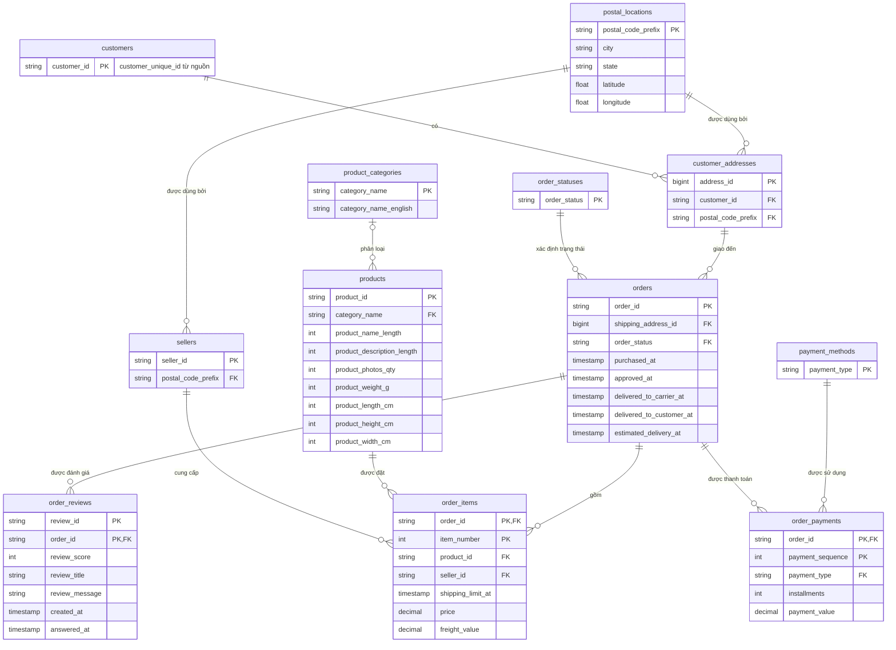
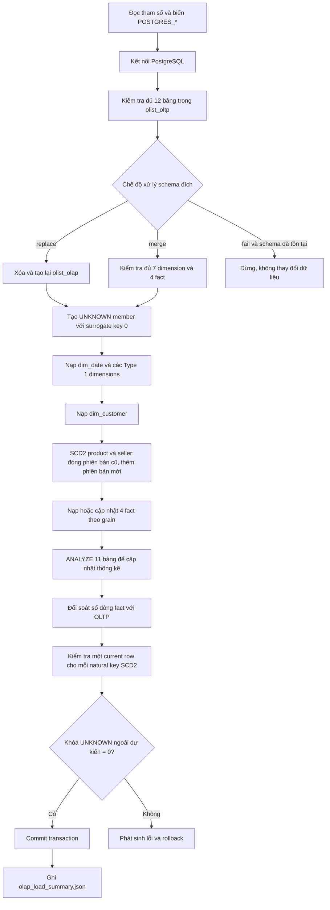

# DE Genesis - Môi trường thực hành Data Engineering 6 tuần

Repo này dựng một môi trường Docker để thực hành roadmap 6 tuần: Python/Java/SQL, PostgreSQL/MySQL, Spark, HDFS, Kafka, Airflow, NiFi, Prometheus và Grafana. Các service nặng được tách theo profile để bạn chỉ bật đúng phần đang học.

Ma trận đối chiếu từng yêu cầu, bằng chứng triển khai và giới hạn còn lại nằm
tại [`ROADMAP_COMPLIANCE.md`](ROADMAP_COMPLIANCE.md).

## Yêu cầu

- Docker Desktop đã bật.
- Khuyến nghị Docker Desktop có ít nhất 8 GB RAM nếu chạy tuần 5 hoặc tuần 6.
- PowerShell trên Windows.

Kiểm tra nhanh:

```powershell
.\scripts\check-env.ps1
```

Kiểm tra cấu hình Compose, Python, Prometheus và toàn bộ test roadmap bằng một
lệnh:

```powershell
.\scripts\verify-roadmap.ps1
```

## Chuẩn bị dữ liệu Olist

Bộ dữ liệu Olist không được lưu trong Git. Tải và giải nén bộ **Brazilian E-Commerce Public Dataset by Olist** vào `data/olist`, sau đó kiểm tra đủ chín file nguồn:

```powershell
.\scripts\check-olist-data.ps1
```

Danh sách tên file chính xác nằm trong [`data/olist/README.md`](data/olist/README.md). Các bài Kafka/Spark Streaming và pipeline log Tuần 6 có thể chạy độc lập khi chưa có Olist; Mock Promotion API sẽ dùng bộ 250 sản phẩm xác định trước.

## Khởi động

Tuần 1 và tuần 2 chỉ cần workspace, PostgreSQL và MySQL:

```powershell
.\scripts\start.ps1 -Target week1 -Build
```

Nếu Docker Desktop báo lỗi `cannot find registry key "SOFTWARE\Docker Inc.\Docker Desktop"` thì Docker đang bị mất registry cài đặt. Mở PowerShell bằng **Run as administrator** rồi chạy:

```powershell
.\scripts\fix-docker-desktop-registry.ps1
```

Sau đó chờ Docker Desktop chạy xong và thử lại lệnh khởi động tuần 1.

Nếu shortcut Docker Desktop tiếp tục lỗi do trỏ vào file root `C:\Program Files\Docker\Docker\Docker Desktop.exe`, dùng script sau để mở backend và frontend đúng đường dẫn:

```powershell
.\scripts\start-docker-desktop.ps1
```

Các mốc profile:

| Target | Service chính |
| --- | --- |
| `week1`, `week2` | workspace, PostgreSQL, MySQL |
| `week3` | thêm HDFS, Spark |
| `week4` | thêm Kafka |
| `week5` | thêm Airflow, NiFi |
| `week6` | thêm Prometheus, Grafana |
| `all` | bật toàn bộ môi trường |

Dừng môi trường:

```powershell
.\scripts\stop.ps1
```

Xóa cả volume dữ liệu Docker khi muốn làm lại từ đầu:

```powershell
.\scripts\stop.ps1 -RemoveVolumes
```

## Tài khoản và cổng mặc định

| Thành phần | URL hoặc cổng | Tài khoản |
| --- | --- | --- |
| PostgreSQL | `localhost:5432` | `de_user` / `de_password` |
| MySQL | `localhost:3306` | `de_user` / `de_password` |
| Jupyter trong workspace | `localhost:8888` | chạy thủ công nếu cần |
| Spark UI | <http://localhost:8080> | không cần đăng nhập |
| HDFS NameNode UI | <http://localhost:9870> | không cần đăng nhập |
| Kafka | `localhost:9092` | không cần đăng nhập |
| Airflow | <http://localhost:8088> | `admin` / `admin` |
| NiFi | <https://localhost:8443/nifi> | `admin` / `admin_password_123` |
| Prometheus | <http://localhost:9090> | không cần đăng nhập |
| Grafana | <http://localhost:3000> | `admin` / `admin` |

Nếu máy bạn đã dùng cổng nào đó, sửa trong file `.env`.

## Tuần 1: Python, SQL, PostgreSQL/MySQL

Nạp file CSV mẫu vào PostgreSQL:

```powershell
docker compose exec workspace python exercises/week1/script/import_olist_to_postgres.py
```

Chạy truy vấn phân tích và xem execution plan:

```powershell
docker compose exec workspace psql -h postgres -U de_user -d de_roadmap -f exercises/week1/script/sql_practice_postgres.sql
```

Mở shell trong container học Linux command line:

```powershell
docker compose exec workspace bash
```

## Tuần 2: OLTP và OLAP

Chạy trước script tuần 1 để có 9 bảng Olist đã làm sạch trong schema
`olist_practice`, sau đó chuyển dữ liệu sang mô hình OLTP 3NF:

```powershell
docker compose exec workspace python exercises/week2/load_olist_oltp.py
```

Script tạo schema `olist_oltp`, các bảng nghiệp vụ có khóa chính, khóa ngoại,
ràng buộc dữ liệu và index. Toàn bộ quá trình chạy trong một transaction; nếu
một bước lỗi, PostgreSQL sẽ rollback schema đích. Kết quả đối soát được ghi tại
`output/week2/oltp_load_summary.json`.

Trong mô hình khách hàng, `customers.customer_id` lấy từ
`customer_unique_id` của dữ liệu nguồn để đại diện cho một khách hàng thực.
Các địa chỉ được tách sang `customer_addresses`. Mỗi đơn hàng chỉ tham chiếu
địa chỉ giao hàng; từ địa chỉ đó xác định được khách hàng. Khi khách hàng có
địa chỉ mới, hệ thống thêm một bản ghi địa chỉ thay vì sửa địa chỉ đã gắn với
các đơn hàng cũ.

### ERD mô hình OLTP



```powershell
docker compose exec workspace python exercises/week2/load_olist_oltp.py --if-exists replace
```

Mặc định script đọc kết nối từ các biến `POSTGRES_*`, lấy dữ liệu nguồn ở
`olist_practice` và ghi sang `olist_oltp`. Có thể đổi bằng các tham số
`--db-url`, `--source-schema` và `--target-schema`.

### Tạo star schema OLAP theo Kimball

Sau khi có schema `olist_oltp`, chạy:

```powershell
docker compose exec workspace python exercises/week2/load_olist_olap.py
```

Script tạo schema `olist_olap` gồm bảy chiều đồng nhất và bốn bảng fact:

| Loại | Bảng |
| --- | --- |
| Dimension | `dim_date`, `dim_customer`, `dim_location`, `dim_product`, `dim_seller`, `dim_order_status`, `dim_payment_method` |
| Fact | `fact_sales`, `fact_payments`, `fact_order_lifecycle`, `fact_reviews` |

Mỗi dimension dùng surrogate key do kho dữ liệu sinh ra và có bản ghi
`UNKNOWN` với khóa `0`. `dim_product` và `dim_seller` dùng SCD Type 2.
`dim_customer` có sẵn các cột quản lý SCD Type 2 để mở rộng khi nguồn có thêm
thuộc tính khách hàng. `dim_date`, `dim_customer`, `dim_location` cùng các
dimension danh mục được dùng lại giữa nhiều fact theo kiến trúc Bus.

#### Bốn bước thiết kế theo Kimball

**Bước 1 - Chọn quy trình nghiệp vụ**

Kho dữ liệu tách bốn quy trình có cách phát sinh dữ liệu khác nhau:

| Quy trình | Sự kiện cần phân tích | Fact |
| --- | --- | --- |
| Bán hàng | Một sản phẩm được đặt từ một seller | `fact_sales` |
| Thanh toán | Một lần thanh toán của đơn hàng | `fact_payments` |
| Vòng đời đơn hàng | Đơn đi qua các mốc mua, duyệt, vận chuyển và giao | `fact_order_lifecycle` |
| Đánh giá | Khách hàng gửi đánh giá cho đơn | `fact_reviews` |

Không gộp bốn quy trình vào một fact vì một đơn có thể có nhiều sản phẩm,
nhiều lần thanh toán và nhiều đánh giá. Nếu join trực tiếp các bảng nguồn,
doanh thu sẽ bị nhân bản.

**Bước 2 - Khai báo grain**

Grain được cố định trước khi chọn dimension và measure:

| Fact | Grain | Khóa nghiệp vụ chống trùng |
| --- | --- | --- |
| `fact_sales` | Một sản phẩm trong một đơn hàng | `order_id + item_number` |
| `fact_payments` | Một lần thanh toán của một đơn hàng | `order_id + payment_sequence` |
| `fact_order_lifecycle` | Một đơn hàng | `order_id` |
| `fact_reviews` | Một đánh giá của một đơn hàng | `review_id + order_id` |

`order_id`, `item_number`, `payment_sequence` và `review_id` là degenerate
dimensions: chúng được giữ trực tiếp trong fact để truy vết nhưng không có
bảng dimension riêng.

**Bước 3 - Xác định các chiều**

Bảy dimension dùng surrogate key do kho dữ liệu sinh ra. Các dimension dùng
chung tạo thành kiến trúc Bus:

| Quy trình | Date | Customer | Location | Product | Seller | Status | Payment method |
| --- | :---: | :---: | :---: | :---: | :---: | :---: | :---: |
| Bán hàng | ✓ | ✓ | ✓ | ✓ | ✓ | ✓ |  |
| Thanh toán | ✓ | ✓ | ✓ |  |  | ✓ | ✓ |
| Vòng đời đơn | ✓ | ✓ | ✓ |  |  | ✓ |  |
| Đánh giá | ✓ | ✓ | ✓ |  |  | ✓ |  |

`dim_date` là role-playing dimension: cùng một bảng được dùng cho ngày mua,
ngày duyệt, ngày giao, ngày dự kiến và ngày đánh giá. `dim_product` và
`dim_seller` dùng SCD Type 2: khi thuộc tính thay đổi, script đóng phiên bản
cũ rồi tạo dòng mới với surrogate key mới. Natural key từ Olist vẫn được giữ
để đối soát.

**Bước 4 - Xác định các fact**

Chỉ lưu khóa dimension và measure đúng với grain:

| Fact | Measure được lưu | Measure tính khi truy vấn |
| --- | --- | --- |
| `fact_sales` | `item_price`, `freight_value` | `gross_amount = item_price + freight_value` |
| `fact_payments` | `installments`, `payment_value` | Tổng tiền, số lần thanh toán |
| `fact_order_lifecycle` | `approval_hours`, `delivery_days`, `delivery_variance_days` | Tỷ lệ đúng hạn, tỷ lệ hủy |
| `fact_reviews` | `review_score`, `response_hours`, cờ có tiêu đề/nội dung | Điểm trung bình, tỷ lệ đánh giá tích cực |

Các trường mô tả như tên danh mục, thành phố, nhóm trạng thái và nhóm thanh
toán nằm trong dimension, không lặp lại trong fact.

#### Sơ đồ star schema và kiến trúc Bus

```mermaid
erDiagram
    dim_date ||--o{ fact_sales : "purchase và shipping-limit date"
    dim_date ||--o{ fact_payments : "purchase date"
    dim_date ||--o{ fact_order_lifecycle : "năm vai trò ngày"
    dim_date ||--o{ fact_reviews : "created và answered date"

    dim_customer ||--o{ fact_sales : "mua"
    dim_customer ||--o{ fact_payments : "thanh toán"
    dim_customer ||--o{ fact_order_lifecycle : "sở hữu đơn"
    dim_customer ||--o{ fact_reviews : "đánh giá"

    dim_location ||--o{ fact_sales : "nơi giao"
    dim_location ||--o{ fact_payments : "nơi giao"
    dim_location ||--o{ fact_order_lifecycle : "nơi giao"
    dim_location ||--o{ fact_reviews : "nơi giao"

    dim_order_status ||--o{ fact_sales : "trạng thái"
    dim_order_status ||--o{ fact_payments : "trạng thái"
    dim_order_status ||--o{ fact_order_lifecycle : "trạng thái"
    dim_order_status ||--o{ fact_reviews : "trạng thái"

    dim_product ||--o{ fact_sales : "sản phẩm"
    dim_seller ||--o{ fact_sales : "người bán"
    dim_payment_method ||--o{ fact_payments : "phương thức"

    dim_date {
        int date_key PK
        date full_date
        int month_number
        int quarter_number
        int year_number
        boolean is_weekend
    }

    dim_customer {
        bigint customer_key PK
        string source_system
        string customer_id
        timestamp effective_from
        timestamp effective_to
        boolean is_current
        int version_number
    }

    dim_location {
        bigint location_key PK
        string postal_code_prefix
        string city
        string state
        float latitude
        float longitude
    }

    dim_product {
        bigint product_key PK
        string product_id
        string category_name
        string category_name_english
        timestamp effective_from
        timestamp effective_to
        boolean is_current
        int version_number
    }

    dim_seller {
        bigint seller_key PK
        string seller_id
        string postal_code_prefix
        string city
        string state
        timestamp effective_from
        timestamp effective_to
        boolean is_current
        int version_number
    }

    dim_order_status {
        int order_status_key PK
        string order_status
        string status_group
        boolean is_completed
        boolean is_cancelled
    }

    dim_payment_method {
        int payment_method_key PK
        string payment_type
        string payment_group
    }

    fact_sales {
        int purchase_date_key FK
        int shipping_limit_date_key FK
        bigint customer_key FK
        bigint shipping_location_key FK
        bigint product_key FK
        bigint seller_key FK
        int order_status_key FK
        string order_id PK
        int item_number PK
        decimal item_price
        decimal freight_value
    }

    fact_payments {
        int purchase_date_key FK
        bigint customer_key FK
        bigint shipping_location_key FK
        int payment_method_key FK
        int order_status_key FK
        string order_id PK
        int payment_sequence PK
        int installments
        decimal payment_value
    }

    fact_order_lifecycle {
        string order_id PK
        int purchase_date_key FK
        int approved_date_key FK
        int carrier_date_key FK
        int delivered_date_key FK
        int estimated_delivery_date_key FK
        bigint customer_key FK
        bigint shipping_location_key FK
        int order_status_key FK
        decimal approval_hours
        decimal delivery_days
        decimal delivery_variance_days
    }

    fact_reviews {
        int review_created_date_key FK
        int review_answered_date_key FK
        bigint customer_key FK
        bigint shipping_location_key FK
        int order_status_key FK
        string review_id PK
        string order_id PK
        int review_score
        decimal response_hours
        boolean has_title
        boolean has_message
    }
```



#### Luồng hoạt động của script OLAP

Toàn bộ phần thay đổi PostgreSQL chạy trong một transaction. Nếu tạo bảng,
nạp dimension, nạp fact hoặc đối soát lỗi, schema đích được rollback.



Khi cần nạp tăng dần và giữ các phiên bản SCD Type 2 đã có:

```powershell
docker compose exec workspace python exercises/week2/load_olist_olap.py --if-exists merge
```

Chế độ `replace` tạo lại toàn bộ schema; `merge` cập nhật dimension/fact hiện
có và thêm phiên bản mới khi thuộc tính SCD Type 2 thay đổi. Kết quả đối soát
được ghi tại `output/week2/olap_load_summary.json`.

## Tuần 3: Spark, HDFS, Parquet/ORC

Tài liệu học đầy đủ về RDD, DataFrame, Spark SQL, Driver/Executor/Cluster
Manager, kiến trúc và lệnh HDFS, cách đọc benchmark nằm tại
[`exercises/week3/README.md`](exercises/week3/README.md).

Khởi động profile big data. Với bài 1 GiB+, nên cấp 4 core và 4 GB cho worker:

```powershell
$env:SPARK_WORKER_CORES = "4"
$env:SPARK_WORKER_MEMORY = "4G"
docker compose --profile bigdata up -d --build
```

### Smoke test trên dữ liệu nhỏ

Job mẫu kiểm tra header, ép kiểu, loại trùng, tách dòng lỗi, aggregate và đọc
lại Parquet/ORC để đối soát:

```powershell
docker compose exec spark-master /opt/spark/bin/spark-submit --master spark://spark-master:7077 /workspace/exercises/week3/spark_batch.py
```

Kết quả local nằm trong `output/week3`:

| Thư mục | Nội dung |
| --- | --- |
| `curated_sales_parquet` | Dữ liệu chuẩn hóa dạng Parquet, partition theo năm/tháng |
| `curated_sales_orc` | Cùng dữ liệu chuẩn hóa ở định dạng ORC |
| `rejected_rows` | Dòng không đạt quy tắc chất lượng và lý do loại |
| `category_summary` | Tổng hợp đơn hàng, khách hàng, số lượng và doanh thu theo danh mục |
| `region_summary` | Tổng hợp theo khu vực |
| `daily_summary` | Tổng hợp theo ngày |
| `quality_report` | Báo cáo JSON đối soát đầu vào, đầu ra và doanh thu |

### Bài thực hành chính trên dữ liệu tối thiểu 1 GiB

Generator nhân bản có kiểm soát 112.650 order item Olist, thêm
`replica_id`/`synthetic_item_id`, ghi CSV vào HDFS và chỉ thành công khi các
data file đạt ít nhất `1.073.741.824` byte:

```powershell
docker compose exec spark-master /opt/spark/bin/spark-submit `
  --master spark://spark-master:7077 `
  --driver-memory 2g --executor-memory 3g --executor-cores 4 `
  --conf spark.cores.max=4 `
  --conf spark.hadoop.dfs.replication=1 `
  /workspace/exercises/week3/generate_olist_1gb.py `
  --target-gib 1.0 --partitions 16
```

Pipeline chính dùng DataFrame để broadcast join năm dimension, dùng DataFrame,
Spark SQL và RDD để tạo/đối chiếu aggregate, sau đó ghi cùng một curated
dataset thành CSV không nén, Parquet/Snappy và ORC/Snappy. Mỗi format chạy hai
workload, một warm-up và ba trial đo, tổng cộng 18 trial chính thức:

```powershell
docker compose exec spark-master /opt/spark/bin/spark-submit `
  --master spark://spark-master:7077 `
  --driver-memory 2g --executor-memory 3g --executor-cores 4 `
  --conf spark.cores.max=4 `
  --conf spark.hadoop.dfs.replication=1 `
  /workspace/exercises/week3/olist_format_benchmark.py `
  --shuffle-partitions 16 --output-partitions 16 --warmups 1 --trials 3

docker compose exec namenode hdfs dfs -cat /data/week3/benchmark/quality_report/part-*
docker compose exec namenode hdfs dfs -cat /data/week3/benchmark/benchmark_summary/part-*
docker compose exec namenode hdfs fsck /data/week3 -files -blocks -locations
```

Lần chạy đã kiểm chứng ngày 14/07/2026 dùng input `1.188.929.308` byte,
`6.646.350` dòng và cho kết quả:

| Format | Kích thước | Tỷ lệ so với CSV | Full scan median | Filter/group median |
| --- | ---: | ---: | ---: | ---: |
| CSV không nén | 2.362.228.970 byte | 100,00% | 14,144 giây | 8,314 giây |
| Parquet/Snappy | 203.140.258 byte | 8,60% | 1,170 giây | 1,246 giây |
| ORC/Snappy | 167.822.712 byte | 7,10% | 1,733 giây | 1,278 giây |

File [`exercises/week3/benchmark_result.json`](exercises/week3/benchmark_result.json)
lưu snapshot tóm tắt đã kiểm chứng; từng trial, checksum và physical plan nằm
trong HDFS. Lần chạy có 0 orphan, DataFrame = SQL = RDD, checksum ba format
bằng nhau, đủ 18 measured trial và HDFS `HEALTHY`.

Không dùng `--allow-small-input` trong lần nghiệm thu. Dữ liệu mở rộng dùng để
benchmark, không phải giao dịch Olist thật. Báo cáo ghi kích thước, file count,
thời gian ghi, từng trial, median/min/max, checksum kết quả và physical plan;
không hard-code số liệu dự kiến.

Chạy kiểm thử logic join, tổng hợp và đối chiếu ba Spark API:

```powershell
docker compose exec workspace pytest -q exercises/week3/tests
```

## Tuần 4: Kafka và Spark Structured Streaming

Khởi động thêm Kafka:

```powershell
.\scripts\start.ps1 -Target week4 -Build
```

Topic `service-logs` được `kafka-init` tạo tự động. Có thể dùng lệnh sau để
kiểm tra hoặc tạo lại theo cơ chế idempotent:

```powershell
docker compose exec kafka kafka-topics --bootstrap-server kafka:29092 --create --if-not-exists --topic service-logs --partitions 3 --replication-factor 1
```

Mở terminal thứ nhất để gửi log mẫu. Mặc định producer chạy liên tục; dùng
`--count` và `--seed` khi cần một lần chạy hữu hạn, có thể tái lập:

```powershell
docker compose exec workspace python exercises/week4/kafka_producer.py
docker compose exec workspace python exercises/week4/kafka_producer.py --count 20 --interval 0.2 --seed 42
```

Mở terminal thứ hai để chạy streaming job:

```powershell
docker compose exec spark-master /opt/spark/bin/spark-submit --master spark://spark-master:7077 --conf spark.jars.ivy=/tmp/.ivy2 --packages org.apache.spark:spark-sql-kafka-0-10_2.12:3.5.1 /workspace/exercises/week4/spark_streaming_kafka.py
```

`spark.jars.ivy=/tmp/.ivy2` đặt cache dependency vào thư mục ghi được trong
container Spark. Job đọc JSON từ Kafka, kiểm tra schema, dùng event time cùng
watermark rồi tổng hợp theo cửa sổ thời gian, service và status code. Bản ghi
không hợp lệ được đưa vào Parquet quarantine kèm payload, lý do và Kafka
offset; metric accepted/rejected được ghi idempotent theo micro-batch. Kết quả
báo cáo, quarantine, metric và checkpoint dùng các đường dẫn riêng để không
ghi đè lẫn nhau. `failOnDataLoss=true` là mặc định; chỉ bật
`--allow-data-loss` khi chủ động chấp nhận mất offset trong lab.

Để xử lý hết dữ liệu đang có rồi tự kết thúc, thêm `--available-now`. Tham số
`--starting-offsets earliest` chỉ có tác dụng khi checkpoint chưa tồn tại:

```powershell
docker compose exec spark-master /opt/spark/bin/spark-submit --master spark://spark-master:7077 --conf spark.jars.ivy=/tmp/.ivy2 --packages org.apache.spark:spark-sql-kafka-0-10_2.12:3.5.1 /workspace/exercises/week4/spark_streaming_kafka.py --starting-offsets earliest --available-now
```

Vì sink dùng `append` và watermark, cửa sổ mới nhất chỉ được ghi khi event
time đã tiến đủ xa để đóng cửa sổ. Không dùng chung một checkpoint cho hai
topic hoặc hai cấu hình cửa sổ khác nhau. Chạy kiểm thử logic producer, parse
JSON, lọc dữ liệu và tổng hợp bằng:

```powershell
docker compose exec workspace pytest -q exercises/week4/tests
```

Báo cáo tổng hợp tuần 3-4, file Markdown nguồn và script tái tạo DOCX nằm tại
`exercises/week4/report`.

## Tuần 5: Airflow, NiFi và tích hợp API

Tuần 5 xây ba pipeline trên cùng môi trường tích hợp:

- Airflow gọi REST API, ghi raw và điều phối Spark, lịch `0 6 * * *`.
- NiFi phân trang đủ nguồn REST, ghi raw rồi kích hoạt Airflow qua REST API.
- Airflow hợp nhất CSV + PostgreSQL + REST API, Spark tạo data mart Parquet,
  lịch `30 6 * * *`.

Khởi động toàn bộ workflow:

```powershell
.\scripts\start.ps1 -Target week5 -Build
```

Tạo schema tuần 5:

```powershell
docker compose exec workspace psql -h postgres -U de_user -d de_roadmap -f exercises/week5/sql/create_week5_schemas.sql
```

Mock API ở <http://localhost:8000/docs>. Mở Airflow tại
<http://localhost:8088>, đăng nhập `admin` / `admin`, rồi bật:

- `de_genesis_week5_airflow_ingestion`
- `de_genesis_week5_nifi_downstream`
- `de_genesis_week5_multisource`

Mở NiFi tại <https://localhost:8443/nifi> và làm theo
`exercises/week5/nifi/huong_dan_import_flow.md`. Trình duyệt có thể cảnh báo
chứng chỉ tự ký; chỉ tiếp tục trong môi trường local. Hướng dẫn chi tiết, cách
chạy test, hợp đồng API key/OAuth2/SOAP và truy vấn đối soát nằm tại
`exercises/week5/README.md`. Blueprint JSON v2 cùng configurator là nguồn chuẩn.
Native flow v2 đã được xuất và xác thực trên NiFi 1.27.0; sau khi
import phải nạp lại hai sensitive parameter vì artifact không lưu secret.

## Tuần 6: Hệ thống xử lý service log production-like

Pipeline chính của Tuần 6 bám đúng dự án log trong roadmap:

- service log được đẩy vào Kafka `week6-service-logs`;
- Spark Structured Streaming chạy micro-batch mặc định 30 giây và từ chối cấu
  hình vượt SLA 60 giây;
- raw Parquet trên HDFS được phân vùng theo `ingest_date/ingest_hour/rotation_5m`
  rồi `stream_batch_id`, nên retry không nhân đôi epoch;
- report số request/phút và phân bố HTTP status được lưu ở HDFS lẫn PostgreSQL;
- Airflow chạy report cửa sổ đóng mỗi 5 phút, có health gate, DQ gate và
  backfill tối đa 7 ngày mỗi run;
- Prometheus/Grafana theo dõi heartbeat, batch lỗi, bản ghi lỗi, report lỗi và
  độ trễ event-to-HDFS; alert SLA bật khi độ trễ vượt 60 giây.

Pipeline Promotion hằng ngày vẫn được giữ như phần mở rộng. Nó đã dùng
`staging → quality gate → atomic publish`, Spark JDBC phân tán và watermark lấp
gap, nên dữ liệu lỗi không còn được publish trước khi DQ hoàn tất.

Khởi động đầy đủ:

```powershell
.\scripts\start.ps1 -Target week6 -Build
```

Mở Airflow tại <http://localhost:8088> và bật DAG:

```text
de_genesis_week6_log_report
de_genesis_week6_production_pipeline
```

Producer và streaming service được Compose khởi động cùng profile monitoring.
Có thể kiểm tra tiến trình và raw HDFS bằng:

```powershell
docker compose ps week6-log-producer week6-log-streaming
docker compose exec namenode hdfs dfs -ls -R /data/week6/raw/service-logs
```

Để backfill report log, trigger `de_genesis_week6_log_report` với:

```json
{
  "window_start": "2026-08-13T00:00:00Z",
  "window_end": "2026-08-14T00:00:00Z"
}
```

Để chạy batch Promotion mở rộng, trigger với:

```json
{
  "batch_id": "week6-runtime-20260720",
  "window_start": "2026-07-20T00:00:00Z",
  "window_end": "2026-07-21T00:00:00Z",
  "scenario": "success"
}
```

Prometheus ở <http://localhost:9090>, trang alert ở
<http://localhost:9090/alerts>, Grafana ở <http://localhost:3000> và metrics
exporter ở <http://localhost:9108/metrics>. Dashboard
`DE Genesis - Pipeline Production` được tạo tự động. Hướng dẫn backfill,
raw rotation 5 phút, quality gate, truy vấn audit và kiểm thử nằm tại
`exercises/week6/README.md`.

## Cấu trúc thư mục

```text
data/sample/             Dữ liệu mẫu CSV và log JSONL
exercises/week1/         Python + SQL cơ bản
exercises/week2/         Script chuyển dữ liệu Olist sang OLTP và OLAP
exercises/week3/         Spark batch 1 GiB+, benchmark định dạng và kiểm thử
exercises/week4/         Kafka producer, Spark streaming, kiểm thử và báo cáo
exercises/week5/         Airflow, NiFi, Promotion API, Spark core và báo cáo
exercises/week6/         Production pipeline, monitoring, alert rules và báo cáo
mock_api/                FastAPI mô phỏng Promotion API
dags/                    DAG Airflow tuần 5 và tuần 6
config/prometheus/       Cấu hình scrape và alert rules
config/grafana/          Data source và dashboard được provision
config/spark/            Prometheus metrics sink cho Spark
scripts/                 Script PowerShell để bật/tắt môi trường
```

## Ghi chú

- Môi trường này phục vụ học tập local, chưa phải cấu hình bảo mật production.
- Lần đầu chạy `-Build` và pull image sẽ lâu vì Spark, Airflow, NiFi, Hadoop khá lớn.
- File `.env` được tạo từ `.env.example`; bạn có thể sửa cổng hoặc mật khẩu tại đó.
