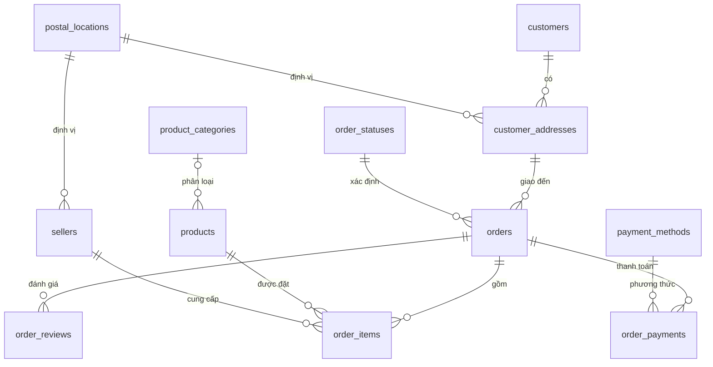
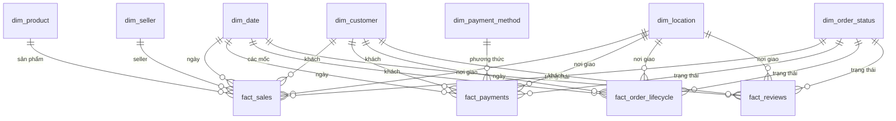

# BÁO CÁO TUẦN 2

## THIẾT KẾ CƠ SỞ DỮ LIỆU OLTP VÀ KHO DỮ LIỆU OLAP THEO KIMBALL

**Dự án:** DE Genesis - Lộ trình thực hành Data Engineering  
**Bộ dữ liệu:** Brazilian E-Commerce Public Dataset by Olist  
**Công nghệ:** Python, PostgreSQL 16, SQLAlchemy, Docker Compose  
**Thời gian hoàn thành:** 04/07/2026

---

## TÓM TẮT BÁO CÁO

Tuần 2 tập trung vào hai bài toán có mục tiêu khác nhau nhưng liên kết chặt chẽ. Bài toán thứ nhất là chuyển dữ liệu thương mại điện tử Olist đã làm sạch thành mô hình OLTP chuẩn hóa, bảo đảm tính toàn vẹn và phù hợp với các thao tác nghiệp vụ. Bài toán thứ hai là chuyển dữ liệu từ OLTP sang kho dữ liệu OLAP dạng star schema theo phương pháp Kimball để phục vụ báo cáo và phân tích.

Kết quả chính của tuần 2 gồm:

- Xây dựng schema `olist_oltp` gồm 12 bảng, 12 khóa ngoại và 22 index.
- Chuẩn hóa khách hàng thành 96.096 khách hàng thực và 96.350 địa chỉ.
- Xây dựng schema `olist_olap` gồm 7 conformed dimensions và 4 fact tables.
- Sử dụng surrogate key, unknown member, role-playing dimension và SCD Type 2.
- Hỗ trợ ba chế độ nạp: `replace`, `merge` và `fail`.
- Đối soát đầy đủ số dòng giữa nguồn và đích.
- Kiểm tra thành công tính idempotent và cơ chế sinh phiên bản SCD Type 2.
- Không phát sinh khóa `UNKNOWN` ngoài dự kiến trong các dimension bắt buộc.

Kết quả phân tích nhanh từ kho dữ liệu cho thấy 98.666 đơn có dòng sản phẩm, 112.650 dòng bán hàng, tổng giá trị hàng và vận chuyển đạt 15.843.553,24; thời gian giao hàng trung bình là 12,56 ngày; tỷ lệ giao đúng hạn đạt 91,89%; điểm đánh giá trung bình đạt 4,09/5.

## MỤC LỤC

1. Giới thiệu và mục tiêu  
2. Phạm vi, công nghệ và dữ liệu nguồn  
3. Kiến trúc tổng thể  
4. Thiết kế mô hình OLTP  
5. Logic script nạp OLTP  
6. Thiết kế mô hình OLAP theo Kimball  
7. Logic script nạp OLAP  
8. Kiểm thử và đối soát  
9. Kết quả phân tích minh họa  
10. Đánh giá thiết kế và giới hạn  
11. Hướng dẫn chạy  
12. Kết luận  
- Phụ lục A - Cấu trúc thư mục
- Phụ lục B - Truy vấn kiểm tra
- Phụ lục C - Thuật ngữ

# 1. GIỚI THIỆU VÀ MỤC TIÊU

## 1.1. Bối cảnh

Trong hệ thống dữ liệu doanh nghiệp, cùng một bộ dữ liệu thường phải phục vụ hai nhóm nhu cầu. Hệ thống OLTP tập trung vào việc ghi nhận và cập nhật giao dịch chính xác, trong khi hệ thống OLAP tập trung vào tổng hợp, so sánh và phân tích lịch sử. Nếu dùng trực tiếp cơ sở dữ liệu giao dịch để chạy báo cáo phức tạp, hệ thống dễ gặp truy vấn chậm, logic tổng hợp khó kiểm soát và nguy cơ ảnh hưởng đến hoạt động nghiệp vụ.

Vì vậy, tuần 2 triển khai một luồng hoàn chỉnh: dữ liệu Olist đã làm sạch được chuẩn hóa thành OLTP, sau đó được chuyển tiếp sang star schema Kimball. Cách làm này giúp phân biệt rõ trách nhiệm của từng tầng và tạo nền tảng cho các tuần xử lý batch, streaming và orchestration tiếp theo.

## 1.2. Mục tiêu cụ thể

1. Thiết kế OLTP đạt 3NF ở mức phù hợp với dữ liệu Olist.
2. Xác định đúng primary key, foreign key, check constraint và index.
3. Thiết kế lại khách hàng để một khách hàng có thể có nhiều địa chỉ mà không làm thay đổi lịch sử đơn hàng.
4. Viết script Python có transaction, rollback và đối soát.
5. Thực hiện bốn bước Kimball: chọn quy trình, xác định grain, xác định dimension và xác định fact.
6. Tạo conformed dimensions dùng chung giữa nhiều star schema.
7. Sử dụng surrogate key và unknown member trong kho dữ liệu.
8. Cài đặt SCD Type 2 cho các thuộc tính cần lưu lịch sử.
9. Tạo bốn fact có grain khác nhau mà không gây nhân bản doanh thu.
10. Chạy thật trên PostgreSQL và xác minh kết quả.

## 1.3. Sản phẩm bàn giao

- `exercises/week2/load_olist_oltp.py`: tạo và nạp mô hình OLTP.
- `exercises/week2/load_olist_olap.py`: tạo và nạp star schema Kimball.
- `README.md`: hướng dẫn chạy, ERD, star schema và luồng xử lý.
- `output/week2/oltp_load_summary.json`: kết quả đối soát OLTP.
- `output/week2/olap_load_summary.json`: kết quả đối soát OLAP.
- Báo cáo tuần 2 ở định dạng Markdown và DOCX.

# 2. PHẠM VI, CÔNG NGHỆ VÀ DỮ LIỆU NGUỒN

## 2.1. Công nghệ sử dụng

| Thành phần | Phiên bản/vai trò |
| --- | --- |
| Python | Điều phối DDL, ETL, kiểm tra và sinh báo cáo JSON |
| SQLAlchemy | Quản lý kết nối và transaction PostgreSQL |
| PostgreSQL | Lưu schema làm sạch, OLTP và OLAP |
| Docker Compose | Khởi động môi trường nhất quán |
| DBeaver/psql | Kiểm tra dữ liệu và chạy truy vấn |
| JSON | Lưu kết quả đối soát sau mỗi lần nạp |

PostgreSQL chạy trong container `de-genesis-postgres`, database `de_roadmap`, cổng mặc định `5432`. Các script đọc cấu hình từ `DATABASE_URL` hoặc các biến `POSTGRES_HOST`, `POSTGRES_PORT`, `POSTGRES_DB`, `POSTGRES_USER` và `POSTGRES_PASSWORD`.

## 2.2. Chín bảng dữ liệu Olist đã làm sạch

| Bảng nguồn | Số dòng | Nội dung |
| --- | ---: | --- |
| `customers` | 99.441 | Định danh khách hàng theo đơn và định danh khách hàng thực |
| `geolocation` | 1.000.163 | Mã bưu chính, thành phố, bang và tọa độ |
| `orders` | 99.441 | Trạng thái và các mốc thời gian của đơn |
| `order_items` | 112.650 | Dòng sản phẩm, seller, giá và phí vận chuyển |
| `order_payments` | 103.886 | Lần thanh toán, phương thức và giá trị |
| `order_reviews` | 99.224 | Điểm và nội dung đánh giá |
| `products` | 32.951 | Danh mục và thuộc tính vật lý của sản phẩm |
| `sellers` | 3.095 | Người bán và mã bưu chính |
| `product_category_name_translation` | 71 | Tên danh mục tiếng Bồ Đào Nha và tiếng Anh |

## 2.3. Đặc điểm quan trọng của dữ liệu

- `customer_id` của Olist gắn với lần xuất hiện trong đơn; `customer_unique_id` mới đại diện gần nhất cho một khách hàng thực.
- Một đơn có thể có nhiều dòng sản phẩm, nhiều lần thanh toán và nhiều đánh giá.
- Một khách hàng thực có thể xuất hiện với nhiều mã bưu chính khác nhau.
- `review_id` không duy nhất toàn cục; cặp `(review_id, order_id)` mới bảo đảm duy nhất.
- Một số sản phẩm có danh mục chưa xuất hiện trong bảng dịch.
- Bảng geolocation có nhiều bản ghi cho cùng mã bưu chính và nhiều cách ghi tên địa điểm.
- Các đơn chưa hoàn tất có thể thiếu ngày duyệt, ngày bàn giao cho đơn vị vận chuyển hoặc ngày giao cho khách.

Những đặc điểm này quyết định cách chọn khóa, grain và chiến lược chuẩn hóa.

# 3. KIẾN TRÚC TỔNG THỂ

Luồng dữ liệu được chia thành ba tầng để mỗi tầng có một trách nhiệm rõ ràng.


## 3.1. Tầng làm sạch

Schema `olist_practice` giữ cấu trúc gần với nguồn, nhưng chuỗi rỗng đã được đổi thành `NULL`, ngày giờ được đổi sang `datetime`, cột số được đổi đúng kiểu và các lỗi tên cột `lenght` được sửa thành `length`.

## 3.2. Tầng OLTP

Schema `olist_oltp` tối ưu cho tính toàn vẹn nghiệp vụ. Dữ liệu được chia thành entity và transaction rõ ràng. Các khóa ngoại ngăn việc tạo đơn cho khách hàng không tồn tại hoặc tạo dòng hàng cho sản phẩm không tồn tại.

## 3.3. Tầng OLAP

Schema `olist_olap` tối ưu cho phân tích. Các dimension chứa thuộc tính mô tả; fact chứa foreign key và measure đúng grain. Nhiều fact dùng chung các conformed dimensions để tạo kiến trúc Bus.

# 4. THIẾT KẾ MÔ HÌNH OLTP

## 4.1. Nguyên tắc chuẩn hóa

### 4.1.1. Dạng chuẩn thứ nhất - 1NF

Mỗi ô chỉ chứa một giá trị nguyên tử và không có nhóm lặp. Một đơn có nhiều sản phẩm được biểu diễn thành nhiều dòng trong `order_items`, không lưu danh sách sản phẩm trong một cột của `orders`.

### 4.1.2. Dạng chuẩn thứ hai - 2NF

Mọi thuộc tính không khóa phải phụ thuộc vào toàn bộ khóa chính. Với `order_items`, khóa là `(order_id, item_number)`. `product_id`, `seller_id`, `price` và `freight_value` đều mô tả đúng dòng hàng đó. Thời điểm mua thuộc về `orders`, vì nó chỉ phụ thuộc vào `order_id`.

### 4.1.3. Dạng chuẩn thứ ba - 3NF

Không để thuộc tính không khóa phụ thuộc bắc cầu qua một thuộc tính không khóa khác. Ví dụ:

```text
product_id -> category_name -> category_name_english
```

Vì vậy, tên tiếng Anh của danh mục nằm trong `product_categories`, còn `products` chỉ giữ khóa ngoại `category_name`. Tương tự:

```text
customer_id -> postal_code_prefix -> city, state, latitude, longitude
```

Thông tin địa lý được quản lý tại `postal_locations`.

## 4.2. Vì sao chọn 3NF

3NF là điểm cân bằng phù hợp cho OLTP Olist:

- Giảm lặp và giảm dung lượng cập nhật.
- Tránh update anomaly khi tên danh mục hoặc địa điểm thay đổi.
- Hạn chế insert anomaly và delete anomaly.
- Bảo vệ quan hệ bằng foreign key.
- Số phép join vẫn hợp lý cho quy mô giao dịch.
- Dễ mở rộng entity mà không sửa cấu trúc transaction chính.

Chuẩn hóa cao hơn như BCNF hoặc 4NF có thể chia nhỏ mô hình thêm nhưng không mang lại lợi ích tương xứng cho phạm vi bài toán, trong khi làm truy vấn nghiệp vụ phức tạp hơn.

## 4.3. Thiết kế lại khách hàng

Thiết kế ban đầu có một dòng `customers` cho mỗi `customer_id` nguồn. Tuy nhiên, một người mua thực có thể có nhiều `customer_id`. Mô hình cuối cùng dùng:

- `customers.customer_id`: lấy từ `customer_unique_id`, đại diện khách hàng thực.
- `customer_addresses.address_id`: surrogate key của địa chỉ.
- `customer_addresses.customer_id`: khách hàng sở hữu địa chỉ.
- `customer_addresses.postal_code_prefix`: tham chiếu vị trí.
- `orders.shipping_address_id`: địa chỉ giao hàng tại thời điểm đặt.

Không lưu đồng thời `orders.customer_id` và `orders.shipping_address_id`, vì `shipping_address_id` đã xác định khách hàng. Nếu giữ cả hai sẽ xuất hiện phụ thuộc bắc cầu:

```text
order_id -> shipping_address_id -> customer_id
```

Khi khách hàng thay đổi địa chỉ, hệ thống thêm một dòng mới vào `customer_addresses`. Các đơn cũ tiếp tục trỏ đến địa chỉ cũ, vì vậy lịch sử giao hàng không bị sửa theo hồ sơ hiện tại.

## 4.4. Từ 9 bảng nguồn thành 12 bảng OLTP

| Nguồn | Đích OLTP | Quy tắc biến đổi |
| --- | --- | --- |
| `customers` | `customers`, `customer_addresses` | Tách khách hàng thực và địa chỉ |
| `geolocation` | `postal_locations` | Chọn địa danh chuẩn và lấy tọa độ trung bình theo mã bưu chính |
| `orders` | `orders`, `order_statuses` | Tách miền giá trị trạng thái |
| `order_items` | `order_items` | Giữ grain dòng sản phẩm |
| `order_payments` | `order_payments`, `payment_methods` | Tách miền phương thức thanh toán |
| `order_reviews` | `order_reviews` | Dùng khóa ghép review và order |
| `products` | `products` | Giữ thuộc tính sản phẩm |
| `sellers` | `sellers` | Tham chiếu mã bưu chính |
| Bảng dịch danh mục | `product_categories` | Hợp nhất cả danh mục chưa có bản dịch |

Việc tách `order_statuses` và `payment_methods` không phải điều kiện bắt buộc của 3NF khi bảng chỉ có mã trạng thái. Đây là quyết định quản trị domain nhằm ngăn lỗi chính tả, tập trung hóa tập giá trị hợp lệ và chuẩn bị cho việc bổ sung mô tả.

## 4.5. ERD OLTP



## 4.6. Từ điển bảng OLTP

| Bảng | Khóa chính | Vai trò |
| --- | --- | --- |
| `postal_locations` | `postal_code_prefix` | Địa danh chuẩn và tọa độ |
| `customers` | `customer_id` | Khách hàng thực |
| `customer_addresses` | `address_id` | Các địa chỉ của khách hàng |
| `sellers` | `seller_id` | Người bán |
| `product_categories` | `category_name` | Danh mục và tên dịch |
| `products` | `product_id` | Thuộc tính sản phẩm |
| `order_statuses` | `order_status` | Miền trạng thái hợp lệ |
| `orders` | `order_id` | Vòng đời đơn hàng |
| `order_items` | `order_id + item_number` | Dòng sản phẩm trong đơn |
| `payment_methods` | `payment_type` | Miền phương thức thanh toán |
| `order_payments` | `order_id + payment_sequence` | Một lần thanh toán |
| `order_reviews` | `review_id + order_id` | Một đánh giá của đơn |

## 4.7. Constraint và index

Mô hình OLTP hiện có 12 foreign keys và 22 index. Các check constraint quan trọng:

- Bang phải có đúng hai ký tự viết hoa.
- Latitude nằm trong `[-90, 90]`, longitude nằm trong `[-180, 180]`.
- `item_number` và `payment_sequence` lớn hơn 0.
- Giá, phí vận chuyển và tiền thanh toán không âm.
- Điểm đánh giá nằm từ 1 đến 5.
- Số kỳ trả góp không âm.

Index được đặt trên:

- Primary key và unique constraint.
- Foreign key thường xuyên join.
- `orders(order_status, purchased_at)` để lọc theo trạng thái và thời gian.
- `order_items(product_id)` và `order_items(seller_id)`.
- `customer_addresses(customer_id, postal_code_prefix)`.

Không tạo index cho mọi cột. Mỗi index làm tăng chi phí `INSERT`, `UPDATE`, `DELETE` và có thể ngăn HOT update khi cột được index thay đổi. Script chỉ index các cột có nhu cầu join, lookup hoặc bảo vệ unique.

# 5. LOGIC SCRIPT NẠP OLTP

## 5.1. Tham số

Script `load_olist_oltp.py` hỗ trợ:

```text
--db-url
--source-schema
--target-schema
--if-exists replace|fail
--report-file
```

Mặc định nguồn là `olist_practice`, đích là `olist_oltp`.

## 5.2. Trình tự thực hiện

1. Kiểm tra tên schema bằng regular expression để tránh identifier không hợp lệ.
2. Kiểm tra đủ 9 bảng nguồn.
3. Nếu `replace`, drop schema đích rồi tạo lại.
4. Tạo bảng cha trước và bảng con sau.
5. Tổng hợp địa điểm chuẩn.
6. Nạp khách hàng, địa chỉ, seller và category.
7. Nạp sản phẩm, trạng thái và đơn.
8. Nạp dòng hàng, thanh toán và đánh giá.
9. Tạo index.
10. Chạy `ANALYZE`.
11. So sánh số dòng nguồn - đích.
12. Kiểm tra orphan key.
13. Commit và ghi báo cáo JSON.

## 5.3. Chuẩn hóa geolocation

Bảng geolocation có hơn một triệu dòng nhưng chỉ có khoảng 19 nghìn mã bưu chính. Script dùng bốn CTE:

- `place_observations`: hợp nhất địa danh từ geolocation, customer và seller.
- `place_frequency`: đếm tần suất từng tổ hợp mã bưu chính - thành phố - bang.
- `canonical_place`: dùng `ROW_NUMBER()` chọn tổ hợp xuất hiện nhiều nhất.
- `coordinates`: lấy latitude và longitude trung bình.

Kết quả là 19.177 dòng `postal_locations`, trong đó vẫn bao phủ cả mã bưu chính chỉ xuất hiện ở customer hoặc seller.

## 5.4. Transaction và rollback

Toàn bộ DDL và DML chạy trong:

```python
with engine.begin() as connection:
    ...
```

PostgreSQL hỗ trợ transactional DDL. Nếu một bảng nạp lỗi, constraint không đạt hoặc đối soát sai, toàn bộ schema đích được rollback. Nhờ đó không tồn tại trạng thái nạp dở.

## 5.5. Đối soát OLTP

Với các bảng ánh xạ trực tiếp, script so sánh `COUNT(*)`. Với khách hàng và địa chỉ, script tính:

```sql
COUNT(DISTINCT customer_unique_id)
COUNT(DISTINCT (customer_unique_id, customer_zip_code_prefix))
```

Sau đó script dùng `LEFT JOIN` để phát hiện bản ghi con không có cha. Kết quả thực tế không có orphan key.

# 6. THIẾT KẾ MÔ HÌNH OLAP THEO KIMBALL

## 6.1. Bước 1 - Chọn quy trình nghiệp vụ

| Quy trình | Sự kiện phân tích | Fact |
| --- | --- | --- |
| Bán hàng | Một sản phẩm được đặt từ seller | `fact_sales` |
| Thanh toán | Một lần thanh toán của đơn | `fact_payments` |
| Vòng đời đơn | Đơn đi qua các mốc xử lý | `fact_order_lifecycle` |
| Đánh giá | Khách gửi đánh giá | `fact_reviews` |

Không tạo một fact khổng lồ từ tất cả bảng nguồn. Nếu một đơn có 3 sản phẩm, 2 lần thanh toán và 2 đánh giá, join trực tiếp sẽ tạo `3 x 2 x 2 = 12` dòng và nhân bản doanh thu.

## 6.2. Bước 2 - Xác định grain

| Fact | Grain | Khóa nghiệp vụ |
| --- | --- | --- |
| `fact_sales` | Một dòng sản phẩm trong đơn | `order_id + item_number` |
| `fact_payments` | Một lần thanh toán | `order_id + payment_sequence` |
| `fact_order_lifecycle` | Một đơn hàng | `order_id` |
| `fact_reviews` | Một đánh giá của đơn | `review_id + order_id` |

Grain được khai báo trước dimension và measure. Mọi cột trong fact phải có ý nghĩa tại đúng grain này.

## 6.3. Bước 3 - Xác định dimension

| Dimension | Natural key | Surrogate key | Chiến lược |
| --- | --- | --- | --- |
| `dim_date` | `full_date` | `date_key` | Calendar/role-playing |
| `dim_customer` | `source_system + customer_id` | `customer_key` | Có khung SCD2 |
| `dim_location` | `source_system + postal_code_prefix` | `location_key` | Type 1 |
| `dim_product` | `source_system + product_id` | `product_key` | SCD Type 2 |
| `dim_seller` | `source_system + seller_id` | `seller_key` | SCD Type 2 |
| `dim_order_status` | `source_system + order_status` | `order_status_key` | Type 1/domain |
| `dim_payment_method` | `source_system + payment_type` | `payment_method_key` | Type 1/domain |

### 6.3.1. Conformed dimensions và Bus Architecture

| Quy trình | Date | Customer | Location | Product | Seller | Status | Payment |
| --- | :---: | :---: | :---: | :---: | :---: | :---: | :---: |
| Bán hàng | ✓ | ✓ | ✓ | ✓ | ✓ | ✓ |  |
| Thanh toán | ✓ | ✓ | ✓ |  |  | ✓ | ✓ |
| Vòng đời đơn | ✓ | ✓ | ✓ |  |  | ✓ |  |
| Đánh giá | ✓ | ✓ | ✓ |  |  | ✓ |  |

Các fact dùng chung đúng một định nghĩa khách hàng, ngày, vị trí và trạng thái. Đây là “chất keo” tích hợp các data mart. Khi so sánh doanh thu và thanh toán theo tháng, mỗi fact được tổng hợp riêng theo cùng `dim_date`, sau đó mới kết hợp kết quả. Không join raw fact với fact.

### 6.3.2. Role-playing dimension

`dim_date` được dùng với nhiều vai trò:

- Ngày mua.
- Hạn giao cho đơn vị vận chuyển.
- Ngày duyệt.
- Ngày bàn giao carrier.
- Ngày giao khách.
- Ngày giao dự kiến.
- Ngày tạo và trả lời đánh giá.

Một bảng lịch vật lý được alias nhiều lần. Khoảng ngày thực tế từ 04/09/2016 đến 09/04/2020, tổng 1.314 ngày cộng một dòng unknown.

### 6.3.3. Surrogate key

Dimension không dùng trực tiếp mã chuỗi dài từ nguồn làm khóa liên kết fact. Ví dụ:

```text
product_key = 125
product_id  = 1e9e8ef04dbcff4541ed26657ea517e5
```

`product_key` do kho dữ liệu sinh ra, còn `product_id` được giữ để truy vết. Cột `source_system` tránh xung đột natural key khi tích hợp nhiều nguồn.

### 6.3.4. Unknown member

Mỗi dimension có một dòng `UNKNOWN` với surrogate key `0`. Nếu fact đến trước dimension hoặc nguồn thiếu khóa, ETL có thể dùng 0 thay vì `NULL`. Script vẫn kiểm tra các dimension bắt buộc; kết quả hiện tại có 0 khóa unknown ngoài dự kiến.

### 6.3.5. SCD Type 2

`dim_product` và `dim_seller` lưu lịch sử thay đổi:

```text
natural_key
effective_from
effective_to
is_current
version_number
```

Khi thuộc tính thay đổi:

1. Phiên bản hiện tại được cập nhật `effective_to = load_time`.
2. `is_current` của dòng cũ chuyển thành `false`.
3. Một dòng mới được thêm với surrogate key mới.
4. `version_number` tăng thêm 1.
5. Fact được ánh xạ đến phiên bản có hiệu lực tại thời điểm sự kiện.

`dim_customer` có sẵn cấu trúc SCD2 nhưng dữ liệu Olist hiện chỉ có định danh khách hàng, không có tên, email, phân khúc hoặc trạng thái để phát hiện thay đổi. Địa chỉ được lưu theo đơn qua `dim_location`, nên không cần tạo phiên bản customer chỉ vì khách đổi địa chỉ.

## 6.4. Bước 4 - Xác định fact

### 6.4.1. `fact_sales`

Measure vật lý:

- `item_price`
- `freight_value`

Measure tính khi truy vấn:

```text
gross_amount = item_price + freight_value
```

Không lưu `quantity` vì mỗi dòng Olist tương ứng một item; không lưu `gross_amount` vì có thể tính rẻ và tránh dữ liệu dư thừa.

### 6.4.2. `fact_payments`

Measure:

- `installments`
- `payment_value`

`payment_value` cộng được; `installments` thường dùng `AVG`, `MIN`, `MAX`, không cộng trực tiếp.

### 6.4.3. `fact_order_lifecycle`

Đây là accumulating snapshot fact, một dòng cho mỗi đơn. Measure:

- `approval_hours`
- `delivery_days`
- `delivery_variance_days`

Giá trị variance âm nghĩa là giao sớm; dương nghĩa là giao trễ. Các đơn chưa giao có measure `NULL` và date key của mốc chưa có bằng 0.

### 6.4.4. `fact_reviews`

Measure:

- `review_score`
- `response_hours`
- `has_title`
- `has_message`

Điểm đánh giá dùng `AVG`, không dùng `SUM`. Các cờ boolean có thể cast sang integer để tính tỷ lệ có nội dung.

## 6.5. Degenerate dimensions

`order_id`, `item_number`, `payment_sequence` và `review_id` nằm trực tiếp trong fact. Chúng giúp truy vết và xác định grain nhưng không có bảng dimension vì không có thuộc tính mô tả độc lập.

## 6.6. Star schema và kiến trúc Bus



# 7. LOGIC SCRIPT NẠP OLAP

## 7.1. Ba chế độ vận hành

| Chế độ | Hành vi | Trường hợp dùng |
| --- | --- | --- |
| `replace` | Drop và tạo lại toàn bộ | Nạp lần đầu hoặc thay đổi cấu trúc |
| `merge` | Upsert fact, Type 1 dimension và thêm phiên bản SCD2 | Nạp định kỳ |
| `fail` | Dừng nếu schema đã tồn tại | Bảo vệ khỏi ghi đè ngoài ý muốn |

## 7.2. Luồng xử lý

1. Xác thực tên schema.
2. Kiểm tra đủ 12 bảng OLTP nguồn.
3. Chuẩn bị schema theo chế độ.
4. Tạo 7 dimension và 4 fact nếu là schema mới.
5. Thêm unknown member key 0.
6. Sinh `dim_date` bằng `generate_series`.
7. Upsert các Type 1 dimensions.
8. Nạp `dim_customer`.
9. Đóng và thêm phiên bản SCD2 cho product, seller.
10. Nạp bốn fact theo grain.
11. Chạy `ANALYZE` cho 11 bảng.
12. So sánh số dòng fact với bảng nguồn.
13. Kiểm tra mỗi natural key SCD chỉ có một dòng current.
14. Kiểm tra unknown key ngoài dự kiến.
15. Commit và ghi JSON.

## 7.3. Ánh xạ dimension theo thời điểm sự kiện

Khi nạp fact, dimension SCD2 được tìm bằng:

```sql
event_time >= effective_from
AND event_time < effective_to
```

Nhờ đó, giao dịch lịch sử tiếp tục tham chiếu phiên bản sản phẩm hoặc seller có hiệu lực tại thời điểm giao dịch, không bị đổi theo phiên bản hiện tại.

## 7.4. Idempotency

Fact dùng `ON CONFLICT ... DO UPDATE` với khóa đúng grain. Chạy `merge` nhiều lần trên cùng nguồn không tạo thêm dòng. Lần kiểm tra thứ hai giữ nguyên:

- 112.650 dòng sales.
- 103.886 dòng payments.
- 99.441 dòng order lifecycle.
- 99.224 dòng reviews.

## 7.5. Transaction

Tạo schema, nạp dimension, nạp fact và đối soát đều nằm trong một transaction. Chỉ sau khi kiểm tra thành công mới commit. Báo cáo JSON được ghi sau commit và không chứa mật khẩu kết nối.

# 8. KIỂM THỬ VÀ ĐỐI SOÁT

## 8.1. Kết quả OLTP

| Bảng | Số dòng |
| --- | ---: |
| `postal_locations` | 19.177 |
| `customers` | 96.096 |
| `customer_addresses` | 96.350 |
| `sellers` | 3.095 |
| `product_categories` | 73 |
| `products` | 32.951 |
| `order_statuses` | 8 |
| `orders` | 99.441 |
| `order_items` | 112.650 |
| `payment_methods` | 5 |
| `order_payments` | 103.886 |
| `order_reviews` | 99.224 |
| **Tổng** | **662.956** |

## 8.2. Kết quả dimension

| Dimension | Số dòng | Ghi chú |
| --- | ---: | --- |
| `dim_date` | 1.315 | 1.314 ngày và 1 unknown |
| `dim_customer` | 96.097 | 96.096 khách và 1 unknown |
| `dim_location` | 19.178 | 19.177 vị trí và 1 unknown |
| `dim_product` | 32.952 | 32.951 sản phẩm và 1 unknown |
| `dim_seller` | 3.096 | 3.095 seller và 1 unknown |
| `dim_order_status` | 9 | 8 trạng thái và 1 unknown |
| `dim_payment_method` | 6 | 5 phương thức và 1 unknown |

## 8.3. Kết quả fact

| Fact | Nguồn đối chiếu | Nguồn | Đích | Kết quả |
| --- | --- | ---: | ---: | --- |
| `fact_sales` | `order_items` | 112.650 | 112.650 | Đạt |
| `fact_payments` | `order_payments` | 103.886 | 103.886 | Đạt |
| `fact_order_lifecycle` | `orders` | 99.441 | 99.441 | Đạt |
| `fact_reviews` | `order_reviews` | 99.224 | 99.224 | Đạt |

## 8.4. Kiểm thử constraint và index

| Chỉ tiêu | OLTP | OLAP |
| --- | ---: | ---: |
| Foreign key | 12 | 25 |
| Index | 22 | 27 |
| Bảng | 12 | 11 |

PostgreSQL đã chọn index theo chuỗi tra cứu khách hàng - địa chỉ - đơn hàng. Sau bulk load, script chạy `ANALYZE` để optimizer có thống kê mới.

## 8.5. Kiểm thử SCD Type 2

Một sản phẩm được thay đổi tạm thời trong transaction kiểm thử. Kết quả:

```text
Trước: 1 phiên bản, version_number = 1
Sau:   2 phiên bản, đúng 1 dòng current, version_number lớn nhất = 2
```

Toàn bộ thay đổi kiểm thử sau đó được rollback. Dữ liệu thật vẫn có một phiên bản của sản phẩm đó. Điều này chứng minh logic đóng phiên bản cũ và thêm phiên bản mới hoạt động đúng.

## 8.6. Tiêu chí nghiệm thu

- Script Python compile thành công.
- Chế độ `replace` chạy end-to-end.
- Chế độ `merge` chạy lặp không tăng dòng.
- Chế độ `fail` trả exit code 1 và không sửa dữ liệu.
- Số dòng của bốn fact khớp nguồn.
- Không có natural key SCD với nhiều dòng current.
- Số khóa unknown ngoài dự kiến bằng 0.
- Không có orphan key.
- Report JSON không lộ mật khẩu.

# 9. KẾT QUẢ PHÂN TÍCH MINH HỌA

## 9.1. Tổng quan bán hàng

| KPI | Giá trị |
| --- | ---: |
| Đơn có ít nhất một dòng sản phẩm | 98.666 |
| Dòng sản phẩm | 112.650 |
| Giá trị sản phẩm | 13.591.643,70 |
| Phí vận chuyển | 2.251.909,54 |
| Tổng gộp | 15.843.553,24 |

Số đơn trong `fact_sales` thấp hơn tổng 99.441 đơn vì một số đơn bị hủy hoặc không khả dụng không có dòng sản phẩm.

## 9.2. Trạng thái đơn

| Trạng thái | Nhóm | Số đơn |
| --- | --- | ---: |
| delivered | Hoàn thành | 96.478 |
| shipped | Đang xử lý | 1.107 |
| canceled | Không thành công | 625 |
| unavailable | Không thành công | 609 |
| invoiced | Đang xử lý | 314 |
| processing | Đang xử lý | 301 |
| created | Đang xử lý | 5 |
| approved | Đang xử lý | 2 |

Tỷ lệ hủy theo trạng thái `canceled` là 0,63% trên tổng số đơn.

## 9.3. Hiệu suất giao hàng

| KPI | Giá trị |
| --- | ---: |
| Đơn có thời gian giao hoàn chỉnh | 96.476 |
| Thời gian giao trung bình | 12,56 ngày |
| Giao đúng/sớm hạn | 88.655 đơn |
| Giao trễ | 7.821 đơn |
| Tỷ lệ đúng/sớm hạn | 91,89% |
| Tỷ lệ trễ | 8,11% |

`delivery_variance_days <= 0` được xem là đúng hoặc sớm hạn. Chỉ các đơn có ngày giao thực tế mới tham gia mẫu tính tỷ lệ.

## 9.4. Đánh giá khách hàng

| KPI | Giá trị |
| --- | ---: |
| Điểm trung bình | 4,09/5 |
| Đánh giá tích cực, điểm 4-5 | 76.470 |
| Tỷ lệ tích cực | 77,07% |
| Đánh giá tiêu cực, điểm 1-2 | 14.575 |
| Tỷ lệ tiêu cực | 14,69% |

## 9.5. Thanh toán

| Phương thức | Số sự kiện | Giá trị |
| --- | ---: | ---: |
| Credit card | 76.795 | 12.542.084,19 |
| Boleto | 19.784 | 2.869.361,27 |
| Voucher | 5.775 | 379.436,87 |
| Debit card | 1.529 | 217.989,79 |
| Not defined | 3 | 0,00 |
| **Tổng** | **103.886** | **16.008.872,12** |

Tổng thanh toán không được giả định bằng tổng `item_price + freight_value` ở grain dòng hàng. Một đơn có thể có nhiều phương thức, voucher hoặc điều chỉnh. Hai chỉ tiêu phải được tổng hợp trong fact riêng.

## 9.6. Top danh mục theo tổng gộp

| Hạng | Danh mục | Tổng gộp |
| ---: | --- | ---: |
| 1 | health_beauty | 1.441.248,07 |
| 2 | watches_gifts | 1.305.541,61 |
| 3 | bed_bath_table | 1.241.681,72 |
| 4 | sports_leisure | 1.156.656,48 |
| 5 | computers_accessories | 1.059.272,40 |

## 9.7. Top bang theo tổng gộp

| Hạng | Bang | Số đơn | Tổng gộp |
| ---: | --- | ---: | ---: |
| 1 | SP | 41.375 | 5.921.678,12 |
| 2 | RJ | 12.762 | 2.129.681,98 |
| 3 | MG | 11.544 | 1.856.161,49 |
| 4 | RS | 5.432 | 885.826,76 |
| 5 | PR | 4.998 | 800.935,44 |

# 10. ĐÁNH GIÁ THIẾT KẾ VÀ GIỚI HẠN

## 10.1. Điểm mạnh

- Phân tách rõ tầng làm sạch, OLTP và OLAP.
- Mô hình khách hàng không làm mất lịch sử địa chỉ đơn hàng.
- Grain của từng fact được khai báo và kiểm tra bằng khóa.
- Conformed dimensions giúp tích hợp bốn data mart.
- Surrogate key tách kho dữ liệu khỏi natural key nguồn.
- SCD2 đã có logic merge và kiểm thử.
- Transaction bảo vệ tính nguyên tử.
- Unknown member ngăn foreign key `NULL`.
- Đối soát tự động thay vì kiểm tra thủ công.
- Index và `ANALYZE` hỗ trợ optimizer.

## 10.2. Giới hạn của dataset

- Không có tên, email, tuổi hoặc phân khúc khách hàng.
- Không có thời điểm thanh toán chính xác; `fact_payments` dùng ngày mua làm mốc.
- Không có lịch sử thay đổi product/seller trước thời điểm bắt đầu nạp.
- Địa chỉ chỉ có mã bưu chính, không có đường và số nhà.
- Tọa độ là giá trị đại diện trung bình theo mã bưu chính.
- Dữ liệu là snapshot lịch sử; accumulating fact được dựng ở trạng thái cuối, chưa quan sát update theo thời gian thực.
- Ngày cực đại của calendar là 09/04/2020 do timestamp xuất hiện trong dữ liệu nguồn, dù phần lớn giao dịch nằm trong giai đoạn 2016-2018.

## 10.3. Hướng cải tiến

1. Thêm cột audit như `dw_loaded_at`, `dw_updated_at`, `batch_id`.
2. Dùng bảng staging và checksum để tăng tốc phát hiện thay đổi SCD2.
3. Partition fact theo năm hoặc tháng khi dữ liệu tăng lớn.
4. Thêm data quality tests bằng pytest hoặc dbt.
5. Thêm late-arriving dimension handling và quy trình sửa unknown key.
6. Dùng Airflow để điều phối OLTP - OLAP theo lịch.
7. Đưa summary metrics lên Prometheus/Grafana.
8. Xây materialized view cho dashboard thường dùng.
9. Bổ sung incremental watermark dựa trên thời gian cập nhật nguồn.
10. Thiết kế MDM/crosswalk nếu tích hợp khách hàng từ nhiều hệ thống.

# 11. HƯỚNG DẪN CHẠY

## 11.1. Khởi động môi trường

```powershell
.\scripts\start.ps1 -Target week1 -Build
```

## 11.2. Nạp dữ liệu làm sạch

```powershell
docker compose exec workspace python exercises/week1/script/import_olist_to_postgres.py
```

## 11.3. Tạo OLTP

```powershell
docker compose exec workspace python exercises/week2/load_olist_oltp.py
```

## 11.4. Tạo OLAP lần đầu

```powershell
docker compose exec workspace python exercises/week2/load_olist_olap.py
```

## 11.5. Nạp tăng dần

```powershell
docker compose exec workspace python exercises/week2/load_olist_olap.py --if-exists merge
```

## 11.6. Kiểm tra bằng psql

```powershell
docker compose exec postgres psql -U de_user -d de_roadmap
```

```sql
\dt olist_oltp.*
\dt olist_olap.*
```

## 11.7. Kết nối DBeaver

```text
Host: localhost
Port: 5432
Database: de_roadmap
Username: de_user
Password: de_password
```

# 12. KẾT LUẬN

Tuần 2 đã hoàn thành một chuỗi thiết kế dữ liệu có thể chạy và kiểm chứng được. Dữ liệu làm sạch không chỉ được sao chép sang PostgreSQL mà được tổ chức lại theo mục tiêu sử dụng. OLTP ưu tiên tính toàn vẹn, cập nhật và quan hệ nghiệp vụ; OLAP ưu tiên lịch sử, tổng hợp và khả năng phân tích.

Mô hình OLTP giải quyết các vấn đề quan trọng của Olist như định danh khách hàng, nhiều địa chỉ, geolocation trùng lặp, trạng thái và phương thức thanh toán. Mô hình OLAP áp dụng đầy đủ bốn bước Kimball, khai báo grain rõ ràng, dùng conformed dimensions, surrogate key, unknown member, role-playing date và SCD Type 2.

Quan trọng hơn, toàn bộ thiết kế đã được hiện thực bằng script Python, chạy trên dữ liệu thật và có đối soát tự động. Kết quả không dừng ở sơ đồ lý thuyết mà tạo ra hai schema có thể truy vấn ngay, đồng thời sẵn sàng kết nối với Spark, Airflow, BI hoặc pipeline incremental ở các tuần tiếp theo.

# PHỤ LỤC A - CẤU TRÚC THƯ MỤC

```text
exercises/week2/
  load_olist_oltp.py
  load_olist_olap.py
  report/
    bao_cao_tuan_2.md
    bao_cao_tuan_2.docx

output/week2/
  oltp_load_summary.json
  olap_load_summary.json
```

# PHỤ LỤC B - TRUY VẤN KIỂM TRA

## B.1. Doanh thu theo tháng

```sql
SELECT
    d.year_number,
    d.month_number,
    ROUND(SUM(f.item_price + f.freight_value), 2) AS gross_amount
FROM olist_olap.fact_sales AS f
JOIN olist_olap.dim_date AS d
    ON d.date_key = f.purchase_date_key
GROUP BY d.year_number, d.month_number
ORDER BY d.year_number, d.month_number;
```

## B.2. Hiệu suất giao hàng

```sql
SELECT
    ROUND(AVG(delivery_days), 2) AS avg_delivery_days,
    COUNT(*) FILTER (WHERE delivery_variance_days <= 0) AS on_time_orders,
    COUNT(*) FILTER (WHERE delivery_variance_days > 0) AS late_orders
FROM olist_olap.fact_order_lifecycle
WHERE delivery_days IS NOT NULL;
```

## B.3. Doanh thu theo category

```sql
SELECT
    p.category_name_english,
    ROUND(SUM(f.item_price + f.freight_value), 2) AS gross_amount
FROM olist_olap.fact_sales AS f
JOIN olist_olap.dim_product AS p
    ON p.product_key = f.product_key
GROUP BY p.category_name_english
ORDER BY gross_amount DESC;
```

## B.4. Tra cứu phiên bản SCD Type 2

```sql
SELECT
    product_key,
    product_id,
    category_name_english,
    effective_from,
    effective_to,
    is_current,
    version_number
FROM olist_olap.dim_product
WHERE product_id = :product_id
ORDER BY version_number;
```

# PHỤ LỤC C - THUẬT NGỮ

| Thuật ngữ | Giải thích |
| --- | --- |
| OLTP | Hệ thống tối ưu cho ghi và cập nhật giao dịch |
| OLAP | Hệ thống tối ưu cho tổng hợp và phân tích |
| 3NF | Dạng chuẩn thứ ba, loại bỏ phụ thuộc bắc cầu không cần thiết |
| Grain | Ý nghĩa chính xác của một dòng fact |
| Dimension | Bảng chứa ngữ cảnh mô tả để lọc và phân nhóm |
| Fact | Bảng chứa sự kiện, foreign key và measure |
| Measure | Giá trị số dùng để tổng hợp |
| Conformed dimension | Dimension có cùng định nghĩa và được nhiều data mart dùng chung |
| Bus Architecture | Kiến trúc tích hợp data mart qua conformed dimensions |
| Surrogate key | Khóa do kho dữ liệu sinh ra, độc lập natural key nguồn |
| Natural key | Mã nghiệp vụ đến từ hệ thống nguồn |
| SCD Type 2 | Lưu lịch sử dimension bằng cách tạo phiên bản mới |
| Unknown member | Dòng dimension mặc định, thường có key bằng 0 |
| Role-playing dimension | Một dimension vật lý được dùng với nhiều vai trò |
| Degenerate dimension | Mã giao dịch nằm trực tiếp trong fact |
| Accumulating snapshot | Fact một dòng cho entity và cập nhật theo các mốc vòng đời |
| Idempotent | Chạy lặp không tạo bản ghi trùng hoặc làm sai kết quả |
