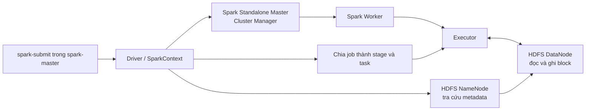

# Tuần 3 - Big Data và xử lý batch bằng Apache Spark

Phần thực hành này có hai mức:

- `spark_batch.py`: smoke test nhanh trên `data/sample/sales.csv` để kiểm tra
  làm sạch dữ liệu, aggregate và ghi Parquet/ORC.
- `generate_olist_1gb.py` + `olist_format_benchmark.py`: bài thực hành chính,
  tạo fact Olist tổng hợp tối thiểu 1 GiB, join với các dimension Olist, dùng
  RDD/DataFrame/Spark SQL và so sánh CSV, Parquet, ORC bằng số đo thực tế.

Dữ liệu lớn được tạo trong HDFS và kết quả nằm trong `output/` hoặc HDFS nên
không được đưa vào Git. Các dòng nhân bản có `replica_id` và
`synthetic_item_id`; đây là dữ liệu benchmark phát sinh có kiểm soát từ Olist,
không phải giao dịch mới hay phần mở rộng chính thức của bộ dữ liệu Olist.

## 1. Kiến thức cần nắm

### RDD, DataFrame và Spark SQL

| API | Cách nhìn dữ liệu | Điểm mạnh | Cách dùng trong bài |
| --- | --- | --- | --- |
| RDD | Tập đối tượng phân tán, không có schema bảng | Kiểm soát biến đổi mức thấp bằng `map`, `mapPartitions`, `reduceByKey` | Tổng hợp doanh thu theo danh mục bằng `mapPartitions` và `reduceByKey` |
| DataFrame | Bảng phân tán có cột và kiểu dữ liệu | Catalyst có thể tối ưu kế hoạch; dễ join, filter, aggregate | Đọc schema tường minh, broadcast join năm bảng dimension, chuẩn hóa và aggregate |
| Spark SQL | Câu SQL chạy trên DataFrame/temp view | Dễ đọc với người quen SQL; dùng cùng engine với DataFrame | `GROUP BY category_english` trên view `week3_olist_sales` |

RDD có transformation lười thực thi. `mapPartitions` và `reduceByKey` chỉ tạo
kế hoạch; Spark bắt đầu chạy khi gặp action như `collect`, `count` hoặc ghi
file. DataFrame và Spark SQL cũng có cơ chế lazy evaluation, nhưng biết schema
và biểu thức nên tối ưu được column pruning, predicate pushdown, join và
physical plan. Xem thêm [RDD Programming Guide](https://spark.apache.org/docs/3.5.7/rdd-programming-guide.html)
và [Spark SQL/DataFrame Guide](https://spark.apache.org/docs/3.5.1/sql-programming-guide.html).

Pipeline tự đối chiếu ba kết quả tổng hợp. Job dừng nếu DataFrame khác Spark
SQL hoặc RDD, nên việc sử dụng đủ ba API không chỉ là code minh họa không chạy.

### Kiến trúc Spark trong repo



- **Driver** chạy hàm `main`, tạo `SparkSession`, lập DAG, chia stage/task và
  thu kết quả action.
- **Executor** chạy task, shuffle, cache/spill partition và ghi part file.
- **Cluster Manager** cấp CPU/RAM cho application. Compose này dùng Spark
  Standalone Master; không nên nhầm Master với Driver.
- **Worker** là node đăng ký tài nguyên với Master; một application nhận một
  executor trên worker hiện có.

So sánh các Cluster Manager trong phạm vi bài học:

| Cluster Manager | Khi phù hợp | Trạng thái trong repo |
| --- | --- | --- |
| Standalone | Cụm Spark đơn giản, ít phụ thuộc, học và lab nhanh | Được triển khai thật bằng `spark-master` và `spark-worker` |
| YARN | Doanh nghiệp đã có Hadoop, cần chia sẻ tài nguyên giữa Spark và hệ sinh thái Hadoop | Chỉ học lý thuyết; Compose chưa có ResourceManager/NodeManager |
| Mesos | Nền tảng cluster manager tổng quát của các hệ thống cũ | Không triển khai; Spark 4.0 đã bỏ hỗ trợ Mesos |
| Kubernetes | Workload container, cấp phát pod động và cloud-native | Không nằm trong đề bài và chưa triển khai trong repo |

Repo pin Spark 3.5.1 để tái lập bài thực hành. Tài liệu hiện hành liệt kê
Standalone, YARN và Kubernetes; [ghi chú Spark 4.0](https://spark.apache.org/releases/spark-release-4-0-0.html)
xác nhận Mesos đã bị loại bỏ. Mesos vẫn được trình bày vì có trong đề cương,
nhưng không nên chọn cho hệ thống Spark mới.

## 2. HDFS

HDFS chia file lớn thành block. NameNode giữ namespace và ánh xạ file/block;
DataNode giữ byte dữ liệu và phục vụ luồng đọc/ghi. Client hỏi NameNode về vị
trí block rồi trao đổi dữ liệu trực tiếp với DataNode, dữ liệu không đi xuyên
qua NameNode. HDFS phù hợp mô hình ghi một lần, đọc nhiều lần và đọc tuần tự
với thông lượng lớn. Xem [HDFS Architecture Guide](https://hadoop.apache.org/docs/stable/hadoop-project-dist/hadoop-hdfs/HdfsDesign.html).

Lab chỉ có một NameNode, một DataNode và replication factor `1`. Cấu hình này
đủ để học namespace, block và URI HDFS, nhưng chưa chứng minh phân tán vật lý,
chịu lỗi hoặc High Availability như một cluster production.

Các lệnh `spark-submit` của lab truyền rõ
`--conf spark.hadoop.dfs.replication=1`. Mã nguồn không ép giá trị này mặc định;
khi trỏ sang cluster nhiều DataNode, job kế thừa replication của cluster hoặc
chỉ đổi khi quản trị viên chủ động đặt `WEEK3_HDFS_REPLICATION`.

Các lệnh thực hành an toàn trong namespace riêng `/data/week3`:

```powershell
# Tạo và liệt kê thư mục
docker compose exec namenode hdfs dfs -mkdir -p /data/week3/raw
docker compose exec namenode hdfs dfs -ls -h /data/week3

# Đưa file lên, xem nội dung và tải file về
docker compose exec namenode hdfs dfs -put -f /workspace/data/sample/sales.csv /data/week3/raw/sales.csv
docker compose exec namenode hdfs dfs -cat /data/week3/raw/sales.csv
docker compose exec namenode hdfs dfs -get /data/week3/raw/sales.csv /tmp/sales-from-hdfs.csv

# Kích thước, quota/count, metadata và sức khỏe block
docker compose exec namenode hdfs dfs -du -s -h /data/week3
docker compose exec namenode hdfs dfs -count -q -h /data/week3
docker compose exec namenode hdfs dfs -stat "%n %b byte, replication=%r" /data/week3/raw/sales.csv
docker compose exec namenode hdfs fsck /data/week3 -files -blocks -locations

# Sao chép/đổi tên trong HDFS
docker compose exec namenode hdfs dfs -cp /data/week3/raw/sales.csv /data/week3/raw/sales-copy.csv
docker compose exec namenode hdfs dfs -mv /data/week3/raw/sales-copy.csv /data/week3/raw/sales-renamed.csv

# Chỉ xóa đúng file/thư mục lab đã nêu, không xóa /data hoặc /
docker compose exec namenode hdfs dfs -rm /data/week3/raw/sales-renamed.csv
```

## 3. CSV, Parquet và ORC

| Thuộc tính | CSV | Parquet | ORC |
| --- | --- | --- | --- |
| Tổ chức | Theo dòng, text | Theo cột | Theo cột |
| Schema/kiểu | Không tự mô tả đầy đủ; phải truyền schema | Có schema | Có schema |
| Nén trong bài | Không nén | Snappy | Snappy |
| Chỉ đọc cột cần thiết | Không hiệu quả | Có | Có |
| Predicate pushdown/statistics | Hạn chế | Có | Có |
| Khả năng xem bằng text editor | Dễ | Không | Không |
| Trường hợp phù hợp | Trao đổi đơn giản, landing/raw | Data lake và Spark/engine phân tích phổ biến | Hệ sinh thái Hive và workload phân tích cột |

Parquet và ORC thường nhỏ hơn, đọc aggregate ít cột nhanh hơn CSV vì không
phải parse toàn bộ chuỗi và có column pruning. Đây không phải quy luật cho mọi
dataset/query: kích thước hàng, cardinality, codec, partition, số file và cache
đều ảnh hưởng. Vì vậy bài đo cả dung lượng lẫn thời gian thay vì kết luận trước.

Cả ba output được tạo từ **cùng một DataFrame**, cùng partition theo
`purchase_year/purchase_month` và cùng số output partition. CSV không nén còn
Parquet/ORC dùng Snappy, đúng với một cấu hình data lake thường gặp; báo cáo
luôn ghi codec để tránh so sánh mơ hồ.

## 4. Luồng thực hành 1 GiB+

### Bước 1 - Khởi động Spark và HDFS

Máy nên còn tối thiểu khoảng 6-8 GB RAM. Có thể cấp 4 core/4 GB cho worker ở
phiên PowerShell hiện tại rồi khởi động profile tuần 3:

```powershell
$env:SPARK_WORKER_CORES = "4"
$env:SPARK_WORKER_MEMORY = "4G"
docker compose --profile bigdata up -d --build
docker compose --profile bigdata ps
```

### Bước 2 - Tạo fact CSV tối thiểu 1 GiB trên HDFS

```powershell
docker compose exec spark-master /opt/spark/bin/spark-submit `
  --master spark://spark-master:7077 `
  --driver-memory 2g `
  --executor-memory 3g `
  --executor-cores 4 `
  --conf spark.cores.max=4 `
  --conf spark.hadoop.dfs.replication=1 `
  /workspace/exercises/week3/generate_olist_1gb.py `
  --target-gib 1.0 `
  --partitions 16
```

Generator đọc 112.650 order item Olist gốc, ước lượng số replica, thêm khóa
tổng hợp, ghi CSV không nén rồi đo lại **các data file thực tế** qua Hadoop
FileSystem. Job chỉ thành công nếu tổng byte ít nhất `1.073.741.824`.

Kiểm tra độc lập:

```powershell
docker compose exec namenode hdfs dfs -du -s -h /data/week3/raw/order_items_1gb_csv
docker compose exec namenode hdfs dfs -cat /data/week3/raw/order_items_1gb_csv_generation_report/part-*
```

### Bước 3 - Join, aggregate, chuyển định dạng và benchmark

```powershell
docker compose exec spark-master /opt/spark/bin/spark-submit `
  --master spark://spark-master:7077 `
  --driver-memory 2g `
  --executor-memory 3g `
  --executor-cores 4 `
  --conf spark.cores.max=4 `
  --conf spark.hadoop.dfs.replication=1 `
  /workspace/exercises/week3/olist_format_benchmark.py `
  --shuffle-partitions 16 `
  --output-partitions 16 `
  --warmups 1 `
  --trials 3
```

Fact được left join và đối soát với:

```text
order_items_1gb
  -> orders theo order_id
  -> customers theo customer_id
  -> products theo product_id
  -> product_category_name_translation theo product_category_name
  -> sellers theo seller_id
```

Mặc định job dừng nếu có khóa dimension không khớp. `--allow-unmatched` chỉ
dùng khi muốn nghiên cứu cách đưa dữ liệu lỗi về `UNKNOWN`. Tương tự,
`--allow-small-input` chỉ dùng smoke test; lần chạy nghiệm thu không dùng cờ
này.

## 5. Phương pháp benchmark

Mỗi format chạy hai workload:

1. `full_scan_aggregate`: đếm toàn bộ dòng, tổng giá, phí vận chuyển và tổng
   doanh thu.
2. `filter_group_aggregate`: lọc partition theo năm lớn nhất rồi group theo
   bang khách hàng và danh mục.

Mặc định có một lượt warm-up và ba lượt đo cho mỗi cặp format/workload, tổng
cộng `3 format x 2 workload x 3 trial = 18` trial được tính. Thứ tự được xáo
trộn bằng seed cố định để giảm thiên lệch do format luôn chạy trước/sau.
`time.perf_counter()` bao quanh cả lúc dựng reader và action `first/collect`;
chỉ dựng DataFrame không được xem là đã đo thời gian Spark.

Job lưu checksum kết quả của từng trial và dừng nếu ba format trả kết quả khác
nhau. Tuy vậy Docker/Windows vẫn có filesystem cache; đây là benchmark tái lập
trong lab, không được gọi là cold-disk benchmark hoặc suy rộng thành SLA
production.

## 6. Đầu ra và cách đọc kết quả

| Đường dẫn dưới `/data/week3/benchmark` | Nội dung |
| --- | --- |
| `curated_csv` | Curated Olist CSV không nén |
| `curated_parquet` | Cùng dữ liệu ở Parquet/Snappy |
| `curated_orc` | Cùng dữ liệu ở ORC/Snappy |
| `category_summary` | Tổng hợp DataFrame theo danh mục |
| `rdd_category_summary` | Kết quả RDD dùng để đối chiếu |
| `state_summary`, `monthly_summary` | Aggregate DataFrame theo bang và tháng |
| `quality_report` | Kích thước input, row count, orphan, tổng doanh thu, cờ đối chiếu |
| `format_storage_report` | Byte, file count, min/max file và thời gian ghi mỗi format |
| `benchmark_trials` | Warm-up và từng trial, thời gian, checksum |
| `benchmark_summary` | Median/min/max theo format và workload |
| `physical_plans` | Physical plan của từng format/workload |
| `run_status` | Marker `success` được ghi cuối cùng; không có marker thì run chưa hoàn tất |

```powershell
docker compose exec namenode hdfs dfs -cat /data/week3/benchmark/quality_report/part-*
docker compose exec namenode hdfs dfs -cat /data/week3/benchmark/benchmark_summary/part-*
docker compose exec namenode hdfs dfs -du -s -h /data/week3/benchmark/curated_csv
docker compose exec namenode hdfs dfs -du -s -h /data/week3/benchmark/curated_parquet
docker compose exec namenode hdfs dfs -du -s -h /data/week3/benchmark/curated_orc
docker compose exec namenode hdfs fsck /data/week3 -files -blocks -locations
```

Một lần chạy chỉ được xem là đạt khi:

- input CSV tối thiểu 1 GiB;
- job chạy với `spark://spark-master:7077` và có executor trên worker;
- không có order/customer/product/seller bị orphan;
- số dòng curated bằng số dòng fact;
- DataFrame = Spark SQL = RDD;
- checksum CSV = Parquet = ORC cho cả hai workload;
- đủ 18 measured trial;
- `hdfs fsck` không có block missing/corrupt.

## 7. Kết quả đã kiểm chứng

Lần chạy ngày 14/07/2026 dùng Spark Standalone 3.5.1, một executor 4 core/3
GiB, 16 shuffle partition và HDFS replication 1. Dataset có 6.646.350 dòng,
1.188.929.308 byte (`1,1073 GiB`). Kết quả chi tiết, có thể đọc bằng máy, nằm
trong các report HDFS; [`benchmark_result.json`](benchmark_result.json) là
snapshot tóm tắt đã kiểm chứng để giữ cùng mã nguồn.

| Format | Codec | Kích thước data | So với CSV | Thời gian ghi | Full scan median | Filter/group median |
| --- | --- | ---: | ---: | ---: | ---: | ---: |
| CSV | Không nén | 2.362.228.970 byte | 100,00% | 33,416 giây | 14,144 giây | 8,314 giây |
| Parquet | Snappy | 203.140.258 byte | 8,60% | 23,151 giây | 1,170 giây | 1,246 giây |
| ORC | Snappy | 167.822.712 byte | 7,10% | 27,658 giây | 1,733 giây | 1,278 giây |

Trong lần đo này, Parquet giảm 91,4% dung lượng và full scan nhanh khoảng
12,09 lần so với CSV; ORC giảm 92,90% dung lượng và full scan nhanh khoảng
8,16 lần. Đây là kết quả trên dataset/cấu hình cụ thể, không phải khẳng định
Parquet luôn nhanh hơn ORC hoặc ngược lại.

Đối soát cuối:

- `unmatched_orders/customers/products/sellers = 0`;
- DataFrame = Spark SQL = RDD;
- checksum của CSV = Parquet = ORC cho cả hai workload;
- 6 warm-up + 18 measured trial;
- HDFS có 0 block thiếu, 0 block hỏng, 0 block under-replicated và trạng thái
  `HEALTHY`.

## 8. Kiểm thử nhanh

```powershell
docker compose exec workspace python -m py_compile `
  exercises/week3/spark_batch.py `
  exercises/week3/generate_olist_1gb.py `
  exercises/week3/olist_format_benchmark.py

docker compose exec workspace pytest -q exercises/week3/tests
```

Pytest dùng fixture nhỏ, không sinh 1 GiB. Việc chạy full 1 GiB là kiểm thử
nghiệm thu riêng để tránh mỗi lần unit test lại tốn nhiều phút và dung lượng.
