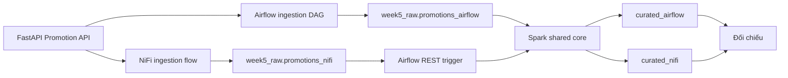

# Tuần 5 - Airflow, NiFi và Promotion API

## Mục tiêu

Tuần 5 xây hai pipeline có cùng đầu vào và cùng logic xử lý để so sánh vai trò
của Airflow và NiFi:

1. Airflow gọi API, ghi raw và điều phối Spark.
2. NiFi gọi API, ghi raw rồi kích hoạt Airflow bằng REST API.

Mock Promotion API chạy local bằng FastAPI và sinh 250 chương trình khuyến mại
từ `product_id` của bộ dữ liệu Olist. Các kịch bản lỗi có tính xác định nên có
thể kiểm thử lại mà không phụ thuộc dịch vụ Internet.

## Kiến trúc



## Khởi động

Docker Desktop phải chạy. Từ thư mục gốc repo:

```powershell
.\scripts\start.ps1 -Target week5 -Build
```

Tạo schema tuần 5:

```powershell
docker compose exec workspace psql -h postgres -U de_user -d de_roadmap `
  -f exercises/week5/sql/create_week5_schemas.sql
```

Tuần 5 kế thừa schema `olist_olap` của tuần 2. Nếu schema này chưa tồn tại:

```powershell
docker compose exec workspace python exercises/week1/script/import_olist_to_postgres.py
docker compose exec workspace python exercises/week2/load_olist_oltp.py
docker compose exec workspace python exercises/week2/load_olist_olap.py
```

## Kiểm tra Mock API

- Health: <http://localhost:8000/health>
- Swagger UI: <http://localhost:8000/docs>
- Danh sách promotion:
  <http://localhost:8000/api/v1/promotions?page=1&page_size=100>

Các giá trị `scenario`:

| Giá trị | Kết quả |
| --- | --- |
| `success` | Response bình thường |
| `rate_limit` | HTTP 429 |
| `server_error` | HTTP 500 |
| `transient_500` | Lỗi 500 ở lần gọi đầu |
| `timeout` | Chậm 15 giây |
| `malformed_json` | JSON không hoàn chỉnh |
| `invalid_record` | Một bản ghi thiếu `product_id` |
| `duplicate` | Một bản ghi bị lặp |
| `empty` | Không có dữ liệu |

## Chạy pipeline Airflow-centric

1. Mở <http://localhost:8088>.
2. Bật DAG `de_genesis_week5_airflow_ingestion`.
3. Trigger với cấu hình mặc định hoặc:

   ```json
   {
     "batch_id": "airflow-demo-001",
     "scenario": "success"
   }
   ```

DAG thực hiện kiểm tra dependency, gọi hết các trang API, ghi
`week5_raw.promotions_airflow`, rồi chạy Spark core.

## Chạy pipeline NiFi-centric

1. Mở <https://localhost:8443/nifi>.
2. Làm theo `nifi/huong_dan_import_flow.md`.
3. Nạp credential nhạy cảm bằng Parameter Context.
4. Chạy Process Group.

NiFi ghi xong raw batch trước khi gọi:

```text
POST /api/v1/dags/de_genesis_week5_nifi_downstream/dagRuns
```

`dag_run_id` có dạng `nifi__<batch_id>`, vì vậy Airflow trả HTTP 409 khi NiFi
gửi trùng cùng một batch.

## Kiểm tra kết quả

```sql
SELECT source_mode, batch_id, status, raw_count, accepted_count,
       rejected_count, curated_count, started_at, finished_at
FROM week5_control.pipeline_runs
ORDER BY started_at DESC;
```

Đối chiếu hai pipeline:

```powershell
docker compose exec workspace python exercises/week5/scripts/compare_pipelines.py
```

Kết quả được ghi vào `output/week5/benchmark/comparison.json`.

## Chạy test

```powershell
docker compose exec -w /workspace workspace python -m pytest -q exercises/week5/tests
docker compose exec -w /workspace workspace python -m pytest -q mock_api/tests
```

## Nguyên tắc an toàn

- Không commit credential thật.
- Watermark chỉ cập nhật sau khi quality checks đạt.
- Không dùng XCom để truyền payload lớn.
- Chỉ cho phép hai bảng raw đã định nghĩa, không nhận tên bảng tùy ý từ REST.
- Basic Auth hiện tại chỉ dành cho môi trường học tập local.
- Không dùng cấu hình này trực tiếp cho production.
