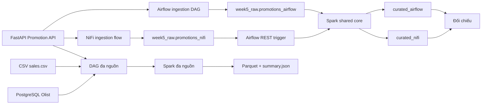

# Tuần 5 - Airflow, NiFi và tích hợp dữ liệu đa nguồn

## Mục tiêu

Tuần 5 xây ba pipeline để thực hành orchestration, ingestion và tích hợp API:

1. Airflow gọi REST API, ghi raw và điều phối Spark; lịch chạy `0 6 * * *`.
2. NiFi gọi đủ các trang REST API, ghi raw rồi kích hoạt Airflow.
3. Airflow chụp ba nguồn CSV + PostgreSQL + REST API, Spark tạo báo cáo
   Parquet; lịch chạy `30 6 * * *`.

Mock Promotion API chạy local bằng FastAPI và sinh 250 chương trình khuyến mại
từ `product_id` của bộ dữ liệu Olist. Các kịch bản lỗi có tính xác định nên có
thể kiểm thử lại mà không phụ thuộc dịch vụ Internet.

## Kiến trúc



## Khởi động

Docker Desktop phải chạy. Từ thư mục gốc repo:

```powershell
.\scripts\start.ps1 -Target week5 -Build
```

Tạo schema tuần 5:

```powershell
docker compose exec workspace psql -h postgres -U de_user -d de_roadmap `
  -f exercises/week5/sql/create_week5_schemas.sql
```

Tuần 5 kế thừa schema `olist_olap` của tuần 2. Nếu schema này chưa tồn tại:

```powershell
docker compose exec workspace python exercises/week1/script/import_olist_to_postgres.py
docker compose exec workspace python exercises/week2/load_olist_oltp.py
docker compose exec workspace python exercises/week2/load_olist_olap.py
```

## Kiểm tra Mock API

- Health: <http://localhost:8000/health>
- Swagger UI: <http://localhost:8000/docs>
- Danh sách promotion:
  <http://localhost:8000/api/v1/promotions?page=1&page_size=100>

Các giá trị `scenario`:

| Giá trị | Kết quả |
| --- | --- |
| `success` | Response bình thường |
| `rate_limit` | HTTP 429 |
| `server_error` | HTTP 500 |
| `transient_500` | Lỗi 500 ở lần gọi đầu |
| `timeout` | Chậm 15 giây |
| `malformed_json` | JSON không hoàn chỉnh |
| `invalid_record` | Một bản ghi thiếu `product_id` |
| `duplicate` | Một bản ghi bị lặp |
| `empty` | Không có dữ liệu |

## Chạy pipeline Airflow-centric

1. Mở <http://localhost:8088>.
2. Bật DAG `de_genesis_week5_airflow_ingestion`.
3. Trigger với cấu hình mặc định hoặc:

   ```json
   {
     "batch_id": "airflow-demo-001",
     "scenario": "success"
   }
   ```

DAG thực hiện kiểm tra dependency, gọi hết các trang API, ghi
`week5_raw.promotions_airflow`, rồi chạy Spark core.

DAG có lịch hằng ngày lúc 06:00. Khi chạy lại cùng `batch_id`, raw không nhân
đôi dữ liệu; khi dùng `batch_id` mới, cùng payload vẫn được lưu thành snapshot
mới. Bảng audit phân biệt rõ:

- `source_count`: số record nhận từ nguồn;
- `inserted_count`: số record được thêm trong lần chạy;
- `duplicate_count`: số record đã có trong chính batch;
- `raw_count = accepted_count + rejected_count`: trạng thái hiện tại của batch.

`promotion_id` được phép `NULL` để lưu record lỗi. Unique index dùng PostgreSQL
16 `NULLS NOT DISTINCT`, vì vậy hai payload lỗi giống nhau trong cùng batch vẫn
được nhận diện là trùng. Migration tự dọn bản sao chính xác do schema cũ để lại,
nhưng cùng payload ở `batch_id` khác vẫn được giữ như một snapshot mới.

## Chạy pipeline NiFi-centric

1. Mở <https://localhost:8443/nifi>.
2. Làm theo `nifi/huong_dan_import_flow.md`.
3. Nạp credential nhạy cảm bằng Parameter Context.
4. Chạy Process Group.

NiFi ghi xong raw batch trước khi gọi:

```text
POST /api/v1/dags/de_genesis_week5_nifi_downstream/dagRuns
```

`dag_run_id` có dạng `nifi__<batch_id>`, vì vậy Airflow trả HTTP 409 khi NiFi
gửi trùng cùng một batch.

Blueprint `nifi/flow_definition.json` là nguồn cấu hình chuẩn phiên bản v2. Flow
dùng `pagination.has_next`, tăng `page` đến khi hết dữ liệu và gom theo parameter
`api.expected.records=250`; với page size 100 sẽ gọi ba trang. Script cấu
hình tạo/gán Parameter Context, tạo/bật hai Controller Service và nối toàn bộ
relationship. File native là runtime export v2 đã được xác thực trên
NiFi 1.27.0 với 21 processor `VALID`, 46 connection và hai Controller Service
`ENABLED/VALID`. Artifact có thể import, nhưng không chứa giá trị sensitive;
phải nạp lại `airflow.password` và `postgres.password`. Blueprint v2 cùng
configurator vẫn là nguồn chỉnh sửa chuẩn, không chỉnh tay file native.

## Chạy pipeline đa nguồn

DAG `de_genesis_week5_multisource` thực hiện:

1. sao chụp `data/sample/sales.csv`;
2. dùng PostgreSQL `COPY TO STDOUT` để stream tổng hợp sản phẩm Olist ra snapshot;
3. gọi đủ trang Promotion REST API;
4. Spark đọc cả ba snapshot, tạo hai data mart `product_promotions` và
   `regional_sales` dưới `output/week5/multisource/<batch_id>/report/`.

Có thể chạy độc lập ngoài Airflow:

```powershell
docker compose exec workspace python -m exercises.week5.multisource `
  --batch-id multisource-demo-001
docker compose exec workspace python -m exercises.week5.spark.multisource_report `
  --manifest output/week5/multisource/multisource-demo-001/manifest.json `
  --output-root output/week5/multisource
```

Spark ưu tiên `WEEK5_SPARK_MASTER` nếu được khai báo riêng, sau đó dùng
`SPARK_MASTER_URL` của Docker Compose; `local[2]` chỉ là fallback cho unit test.

## Contract xác thực REST và SOAP

`api_contracts.py` cung cấp adapter/test contract cho ba kiểu tích hợp thường gặp:

- REST API key qua header cấu hình được;
- OAuth2 Client Credentials, secret chỉ truyền ở runtime;
- SOAP 1.1 envelope và parser chuẩn hóa response về cùng cấu trúc promotion.

Mock API local chạy không xác thực để demo có tính tái lập. Fixture SOAP và
transport giả giúp kiểm thử contract mà không cần thêm dịch vụ ngoài.

## Kiểm tra kết quả

```sql
SELECT source_mode, batch_id, status, source_count, inserted_count,
       duplicate_count, raw_count, accepted_count, rejected_count,
       curated_count, started_at, finished_at
FROM week5_control.pipeline_runs
ORDER BY started_at DESC;
```

Đối chiếu hai pipeline:

```powershell
docker compose exec workspace python exercises/week5/scripts/compare_pipelines.py
```

Kết quả được ghi vào `output/week5/benchmark/comparison.json`.

## Chạy test

```powershell
docker compose exec -w /workspace workspace python -m pytest -q exercises/week5/tests
docker compose exec -w /workspace workspace python -m pytest -q mock_api/tests
docker compose exec workspace psql -h postgres -U de_user -d de_roadmap `
  -v ON_ERROR_STOP=1 -f exercises/week5/sql/test_null_idempotency.sql
```

SQL regression test chạy trong transaction rồi `ROLLBACK`; test xác nhận retry
record invalid có `promotion_id=NULL` không tạo dòng thứ hai, đồng thời batch mới
vẫn được lưu độc lập.

## Nguyên tắc an toàn

- Không commit credential thật.
- Watermark chỉ cập nhật sau khi quality checks đạt.
- Không dùng XCom để truyền payload lớn.
- Chỉ cho phép hai bảng raw đã định nghĩa, không nhận tên bảng tùy ý từ REST.
- Basic Auth hiện tại chỉ dành cho môi trường học tập local.
- Không dùng cấu hình này trực tiếp cho production.
- DAG NiFi downstream chủ ý `schedule=None` vì chỉ nhận sự kiện REST từ NiFi;
  hai DAG chủ động còn lại đều có lịch cron rõ ràng.
