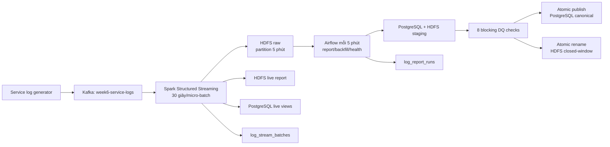

# Tuần 6 - Pipeline log production-like

## Mục tiêu

Tuần 6 triển khai pipeline log riêng theo phương án Docker local đã duyệt, không
coi pipeline Promotion là bài thay thế:

- Dịch vụ sinh log gửi sự kiện vào Kafka.
- Spark Structured Streaming xử lý micro-batch mặc định 30 giây, luôn bị chặn
  cấu hình nếu vượt 60 giây.
- Raw log được lưu trên HDFS theo phân vùng xoay 5 phút.
- Spark tạo báo cáo số request/phút và phân bố HTTP status.
- Báo cáo được lưu cả HDFS Parquet và PostgreSQL.
- Airflow chạy report cửa sổ đóng mỗi 5 phút, hỗ trợ backfill và health gate.
- Telemetry đo lỗi batch, heartbeat và độ trễ event-to-HDFS để Prometheus và
  Grafana sử dụng.

Pipeline Promotion cũ vẫn được giữ như phần mở rộng, nhưng đã đổi sang quy trình
`staging → quality gate → atomic publish` để dữ liệu lỗi không xuất hiện trong
bảng công khai.

## Kiến trúc



Luồng streaming chạy độc lập, không đặt một job vô hạn trong Airflow. Airflow
chịu trách nhiệm cửa sổ đóng, backfill và kiểm tra sức khỏe; cách phân vai này
giúp scheduler không bị chiếm worker bởi tiến trình streaming dài hạn.

## Hợp đồng service log

Một event hợp lệ có dạng:

```json
{
  "event_id": "0c6c8793-8ad2-4937-9f04-2af5ce93ee38",
  "event_time": "2026-08-14T10:00:00+00:00",
  "service": "checkout",
  "method": "POST",
  "path": "/orders",
  "status_code": 201,
  "latency_ms": 42,
  "host": "checkout-1"
}
```

Các trường từ `event_id` đến `latency_ms` là bắt buộc. `status_code` phải nằm
trong `[100, 599]`, `latency_ms` không âm và method phải thuộc allow-list HTTP.
Record lỗi hoặc đến quá ngưỡng event delay vẫn được giữ trong raw với
`is_valid=false` và `validation_error`, nhưng không đi vào report live.

## Raw HDFS và SLA

Mỗi Spark epoch ghi vào một thư mục xác định để retry không nhân đôi file:

```text
/data/week6/raw/service-logs/
  ingest_date=YYYY-MM-DD/
    ingest_hour=HH/
      rotation_5m=YYYYMMDDTHHMMZ/
        stream_generation_id=<generation>/
          stream_batch_id=<epoch>/
```

`rotation_5m` được tính theo Kafka timestamp ổn định và luôn căn tại phút
`00, 05, 10, ...`. Micro-batch mặc định 30 giây; mọi giá trị ngoài `[1, 60]`
bị từ chối trước khi query khởi động. Sau khi raw Parquet commit, job ghi
`ingestion_lag_seconds` vào `week6_control.log_stream_batches`. SLA đạt khi giá
trị này không vượt 60 giây. Độ trễ của batch là giá trị tệ nhất trên các event
hợp lệ, không phải độ trễ của event mới nhất.

Checkpoint mặc định:

`hdfs://namenode:9000/data/week6/checkpoints/service-logs`

Kafka dùng `failOnDataLoss=true`; mất offset phải được xử lý như sự cố thay vì
âm thầm bỏ dữ liệu.

Mỗi checkpoint có `WEEK6_LOG_GENERATION_ID` riêng. Khóa chính telemetry và
contribution là `stream_generation_id + stream_batch_id`; batch quay lùi trong
cùng generation bị chặn trước khi ghi. Generation mới tạo lineage mới khi
epoch reset, nên live view không cộng đôi dữ liệu replay. Nếu chỉ đổi tên
generation nhưng checkpoint tiếp tục đúng epoch kế tiếp, hệ thống giữ lineage
cũ để không làm mất lịch sử. Raw backfill đọc cả layout cũ lẫn mới và loại
trùng theo `event_id`.

## Báo cáo

Spark tạo hai grain:

| Báo cáo | Grain | Chỉ số |
| --- | --- | --- |
| Requests/phút | `minute_start + service` | request count, average/max latency |
| Phân bố status | `minute_start + service + status_code` | request count, percentage |

Streaming ghi contribution theo `stream_generation_id + stream_batch_id`. Hai view
`week6_log.live_requests_per_minute` và
`week6_log.live_status_distribution` cộng lại theo grain, nên retry cùng epoch
không làm tăng số liệu.

DAG `de_genesis_week6_log_report` chạy mỗi 5 phút. Cửa sổ scheduled chờ
settlement mặc định 180 giây, lớn hơn event delay 120 giây cộng micro-batch 30
giây. Vì vậy event hợp lệ đến trễ đúng ngưỡng vẫn được raw commit trước khi cửa
sổ được đóng và không bị bỏ vĩnh viễn. Spark đọc raw theo event time, tái lập
report một phút rồi ghi PostgreSQL staging và HDFS `_staging`; Airflow chạy tám
DQ check trước khi atomic-rename HDFS và thay đúng cửa sổ trong bảng canonical:

- `week6_log.requests_per_minute`
- `week6_log.status_distribution`

Backfill thủ công tối đa 7 ngày mỗi run:

```json
{
  "window_start": "2026-08-13T00:00:00Z",
  "window_end": "2026-08-14T00:00:00Z"
}
```

Cửa sổ là nửa mở `[window_start, window_end)`, phải căn theo phút. Watermark chỉ
tiến khi cửa sổ nối tiếp/đè lên watermark cũ; backfill quá khứ không làm lùi
watermark và backfill tương lai có gap không làm nhảy qua dữ liệu chưa xử lý.
Backfill thủ công cũng chỉ được nhận khi `window_end` đã qua settlement delay.

## Khởi động và chạy

Từ thư mục gốc:

```powershell
.\scripts\start.ps1 -Target week6 -Build
```

Các tiến trình chính mà Compose sử dụng:

```powershell
python -m exercises.week6.log_producer
python -m exercises.week6.spark.stream_service_logs
```

Biến môi trường quan trọng:

| Biến | Mặc định |
| --- | --- |
| `KAFKA_BOOTSTRAP_SERVERS` | `kafka:29092` |
| `WEEK6_LOG_TOPIC` | `week6-service-logs` |
| `WEEK6_LOG_MICRO_BATCH_SECONDS` | `30` |
| `WEEK6_LOG_STREAM_MAX_CORES` | `1`, chừa một core cho report trên worker local |
| `WEEK6_LOG_REPORT_MAX_CORES` | `1` |
| `HDFS_REPLICATION` | `1`, khớp với cụm Docker local có một DataNode |
| `WEEK6_LOG_MAX_EVENT_DELAY_SECONDS` | `120` |
| `WEEK6_LOG_REPORT_SETTLEMENT_SECONDS` | `180`, phải ≥ event delay + micro-batch |
| `WEEK6_LOG_GENERATION_ID` | `local-v1`; bắt buộc đổi khi tạo lại checkpoint |
| `WEEK6_LOG_STARTING_OFFSETS` | `earliest`; chỉ có hiệu lực với checkpoint mới |
| `WEEK6_LOG_RAW_PATH` | `hdfs://namenode:9000/data/week6/raw/service-logs` |
| `WEEK6_LOG_REPORT_PATH` | `hdfs://namenode:9000/data/week6/reports/live` |
| `WEEK6_LOG_REPORT_STAGING_PATH` | `hdfs://namenode:9000/data/week6/reports/_staging/closed` |
| `WEEK6_LOG_CLOSED_REPORT_PATH` | `hdfs://namenode:9000/data/week6/reports/closed` |
| `WEEK6_NAMENODE_WEBHDFS_URL` | `http://namenode:9870` |
| `WEEK6_HDFS_USER` | `root`, pseudo-user của HDFS local để atomic rename |
| `SPARK_MASTER_URL` | `spark://spark-master:7077` trong Compose |

## Data quality cho report log

Quality gate chặn publish nếu:

1. Số grain requests/phút không khớp audit.
2. Số grain status không khớp audit.
3. Tổng request/phút không bằng số event hợp lệ.
4. Tổng request theo status không bằng số event hợp lệ.
5. Grain bị trùng.
6. Status sai miền hoặc phút nằm ngoài cửa sổ.
7. Tỷ lệ status của một phút/service không cộng thành 100% trong sai số làm
   tròn 0,01 điểm phần trăm.
8. Cả hai dataset HDFS staging có marker `_SUCCESS`.

Published HDFS là immutable theo Airflow `run_id`. Retry sau khi rename xác minh
lại hai marker ở destination rồi tiếp tục publish PostgreSQL theo kiểu no-op
nếu transaction trước đã thành công; artifact thiếu marker hoặc destination
xung đột không bao giờ bị ghi đè.

## Promotion pipeline đã harden

Pipeline `de_genesis_week6_production_pipeline` vẫn phục vụ bài mở rộng API,
nhưng không còn xóa snapshot trước DQ:

1. API incremental ghi raw.
2. Raw gate bắt buộc `status`, `updated_at` và cửa sổ nửa mở.
3. Spark đọc PostgreSQL bằng JDBC phân tán, chọn trạng thái mới nhất của mỗi
   promotion, chỉ áp dụng `status='active'`.
4. Spark ghi `week6_curated.sales_promotion_staging`.
5. Curated gate kiểm tra đúng staging của `run_id`.
6. PostgreSQL dùng advisory lock và một transaction để thay snapshot công khai.
7. Watermark scheduled lấp gap; backfill không làm lùi hoặc nhảy qua gap.

Không còn `fetchall()` hoặc `toLocalIterator()` trong Spark snapshot Tuần 6.

## Telemetry cho Prometheus/Grafana

Exporter đọc hai bảng:

- `week6_control.log_stream_batches`: trạng thái epoch, raw/valid/invalid,
  `max_event_time`, `ingestion_lag_seconds`, thời gian hoàn tất và lỗi.
- `week6_control.log_report_runs`: trạng thái report, cửa sổ, số source/grain,
  thời gian hoàn tất và lỗi.

Các trạng thái terminal là `success` và `failed`. `running`, `transforming` và
`quality_failed` không được diễn giải thành thành công.
Exporter luôn phát metric timestamp bằng `0` khi cold start; rule dùng thêm
`absent(...)`, nên `LogStreamStopped` và `LogReportStale` vẫn cảnh báo khi hệ
thống chưa từng có batch/report thành công.

## Kiểm thử

```powershell
python -m pytest exercises/week6/tests -q
```

Test không cần cluster bao phủ cửa sổ xoay 5 phút, giới hạn micro-batch 60 giây,
validation log, backfill, watermark, cấu trúc DAG, staging/DQ/publish, Spark JDBC
và contract telemetry. DDL được thiết kế idempotent và có thể áp dụng lặp lại.

## Giới hạn

Đây là hệ thống production-like trên một máy Docker, chưa phải production thật.
Kafka/HDFS/PostgreSQL hiện chỉ có một node hoặc mức sao chép thấp; credential và
kết nối nội bộ chưa dùng secret manager/TLS; chưa có HA, backup, retention,
network policy hoặc disaster recovery. Các mục này cần thiết kế hạ tầng riêng
trước khi triển khai thật.
