# Tuần 6 - Production pipeline, monitoring và cảnh báo

## Phạm vi đã duyệt

Tuần 6 triển khai theo lựa chọn `A2 B2 C1 D1`:

- Giám sát toàn pipeline và các dependency bằng Prometheus.
- Tạo DAG production riêng có audit, retry, backfill và hai quality gate.
- Cảnh báo chỉ hiển thị trong Prometheus, không gửi ra dịch vụ bên ngoài.
- Báo cáo tuần 5 và tuần 6 được bàn giao thành hai file DOCX độc lập.

## Kiến trúc

```mermaid
flowchart LR
    API["Promotion API"] --> DAG["Airflow production DAG"]
    DAG --> RAW["week6_raw"]
    RAW --> DQ1["Raw quality gate"]
    DQ1 --> SPARK["Spark snapshot refresh"]
    SPARK --> CURATED["week6_curated"]
    CURATED --> DQ2["Curated quality gate"]
    DQ2 --> AUDIT["Audit + watermark"]
    AUDIT --> EXPORTER["Pipeline metrics exporter"]
    EXPORTER --> PROM["Prometheus + alert rules"]
    PROM --> GRAFANA["Grafana dashboard"]
```



Pipeline chạy theo cửa sổ incremental nửa mở `[window_start, window_end)`. API hỗ
trợ cả `updated_since` và `updated_before`. Khi cửa sổ không có thay đổi,
Spark task thực hiện no-op và giữ nguyên snapshot curated. Watermark chỉ cập
nhật sau khi cả hai quality gate đạt.

Khi chạy trong Airflow, Spark driver kết nối cụm standalone qua
`SPARK_MASTER_URL=spark://spark-master:7077`. Khi chạy test ngoài Compose và
không có biến này, job mới fallback về `local[2]`. Image Spark của dự án chuẩn
hóa Python 3.11 cho cả driver và worker để PySpark không gặp lỗi lệch minor
version.

## Khởi động

Docker Desktop phải chạy. Từ thư mục gốc:

```powershell
.\scripts\start.ps1 -Target week6 -Build
```

Các giao diện:

| Dịch vụ | URL | Tài khoản local |
| --- | --- | --- |
| Airflow | <http://localhost:8088> | `admin` / `admin` |
| Promotion API | <http://localhost:8000/docs> | Không yêu cầu |
| Prometheus | <http://localhost:9090> | Không yêu cầu |
| Grafana | <http://localhost:3000> | `admin` / `admin` |
| Pipeline metrics | <http://localhost:9108/metrics> | Không yêu cầu |

Grafana tự động có data source `Prometheus` và dashboard
`DE Genesis - Pipeline Production`; không cần thêm thủ công.

## Chạy production DAG

DAG `de_genesis_week6_production_pipeline` có lịch mặc định `02:00 UTC` mỗi
ngày, `catchup=False` và `max_active_runs=1`.

Để nghiệm thu batch chứa 250 promotion mẫu, trigger thủ công với:

```json
{
  "batch_id": "week6-runtime-20260720",
  "window_start": "2026-07-20T00:00:00Z",
  "window_end": "2026-07-21T00:00:00Z",
  "scenario": "success"
}
```

Backfill được chạy theo từng cửa sổ tối đa 31 ngày. Ví dụ:

```json
{
  "batch_id": "backfill-20260720",
  "window_start": "2026-07-20T00:00:00Z",
  "window_end": "2026-07-21T00:00:00Z"
}
```

`batch_id` chỉ nhận chữ, số, dấu chấm, gạch dưới và gạch ngang. Không bật
`catchup=True` để tránh Airflow tự tạo một lượng lớn run ngoài ý muốn; người
vận hành chủ động chia backfill thành cửa sổ phù hợp.

## Data quality gate

Raw gate kiểm tra:

- Đối soát `accepted + rejected = raw`.
- Đối soát số dòng raw đã lưu.
- Đối soát cờ hợp lệ và audit.
- Tỷ lệ record lỗi không vượt `WEEK6_INVALID_RATE_THRESHOLD`.
- `source_updated_at` thuộc đúng cửa sổ incremental.

Curated gate kiểm tra:

- Số dòng curated khớp audit.
- Grain curated không trùng.
- Discount không âm.
- Net amount không thấp hơn freight.
- Snapshot có cùng số grain với `olist_olap.fact_sales`.

Mặc định ngưỡng record lỗi bằng `0`. Có thể thay đổi tại `.env` hoặc
`dag_run.conf`, nhưng mọi giá trị phải nằm trong `[0, 1]`.

## Metrics và cảnh báo

Exporter đọc audit từ PostgreSQL và kiểm tra Promotion API, Airflow, Spark
master cùng PostgreSQL. Các metric chính:

- `de_genesis_dependency_up`
- `de_genesis_pipeline_runs_total`
- `de_genesis_pipeline_last_success_timestamp_seconds`
- `de_genesis_pipeline_last_run_success`
- `de_genesis_pipeline_last_duration_seconds`
- `de_genesis_pipeline_last_rows`
- `de_genesis_pipeline_last_quality_failures`

Prometheus nạp sáu rule:

- `PipelineMetricsExporterDown`
- `PipelineDependencyDown`
- `PipelineLastRunFailed`
- `PipelineDataQualityFailed`
- `PipelineStale`
- `SparkWorkerUnavailable`

Theo lựa chọn C1, cảnh báo được xem tại <http://localhost:9090/alerts> và không
có Alertmanager hay webhook gửi ra ngoài.

## Truy vấn audit

```sql
SELECT run_id, batch_id, window_start, window_end, status,
       attempt_number, raw_count, accepted_count, rejected_count,
       curated_count, started_at, finished_at
FROM week6_control.pipeline_runs
ORDER BY started_at DESC;
```

```sql
SELECT run_id, check_name, check_status, actual_value, expected_value, details
FROM week6_control.quality_results
ORDER BY checked_at DESC;
```

## Kiểm thử

```powershell
docker compose exec -w /workspace workspace python -m pytest -q `
  exercises/week5/tests mock_api/tests exercises/week6/tests
```

Kiểm tra cấu hình:

```powershell
docker compose --profile bigdata --profile streaming --profile workflow `
  --profile monitoring config --quiet
```

## Giới hạn production

Đây là mô hình production-like cho môi trường học tập local. Khi triển khai
thật cần bổ sung secret manager, TLS tin cậy, remote executor, object storage,
HA cho PostgreSQL/Prometheus và kênh cảnh báo có xác thực.
