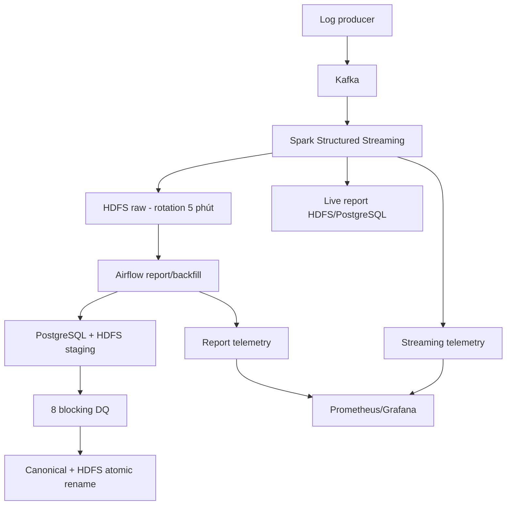

# BÁO CÁO TUẦN 6

## Pipeline log production-like, điều phối và giám sát

**Dự án:** DE Genesis
**Phạm vi:** Kafka, Spark Structured Streaming, HDFS, PostgreSQL, Airflow,
Prometheus và Grafana
**Môi trường mục tiêu:** Docker local theo phương án đã duyệt

# 1. Tóm tắt

Tuần 6 đã được thiết kế lại theo đúng bài toán log của roadmap. Hệ thống có một
luồng độc lập từ service log qua Kafka và Spark Structured Streaming đến HDFS,
không dùng Promotion API làm bằng chứng thay thế. Raw log được commit theo
micro-batch tối đa 60 giây và phân vùng xoay 5 phút. Spark tạo hai báo cáo:
requests/phút và phân bố HTTP status; kết quả được lưu ở HDFS Parquet và
PostgreSQL.

Airflow không giữ tiến trình streaming vô hạn. DAG riêng chạy mỗi 5 phút để
kiểm tra health, tái lập report cửa sổ đóng, hỗ trợ backfill, chạy quality gate
và publish nguyên tử. Telemetry lưu độ trễ event-to-HDFS, heartbeat, số record
lỗi và trạng thái report để Prometheus/Grafana khai thác.

Pipeline Promotion được giữ như phần mở rộng và đã sửa lỗi publish trước DQ:
Spark chỉ ghi staging; quality gate đạt mới thay snapshot công khai trong một
transaction PostgreSQL.

# 2. Đối chiếu roadmap

| Yêu cầu | Hiện thực | Bằng chứng mã nguồn |
| --- | --- | --- |
| Service log → Kafka | Producer có event ID, `acks=all`, idempotent producer | `exercises/week6/log_producer.py` |
| Spark Streaming | Structured Streaming, checkpoint HDFS, micro-batch 30 giây | `spark/stream_service_logs.py` |
| Raw HDFS xoay 5 phút | Partition `ingest_date/ingest_hour/rotation_5m` | `spark/stream_service_logs.py` |
| Độ trễ không quá 1 phút | Cấu hình bị chặn nếu trigger >60 giây; telemetry đo sau raw commit | `log_contracts.py`, `log_stream_batches` |
| Requests/phút | Grain `minute_start + service` | live view và bảng canonical |
| Phân bố status | Grain `minute_start + service + status_code` | live view và bảng canonical |
| Lưu DB/file | PostgreSQL và HDFS Parquet | DDL và hai Spark job |
| Airflow | Report/backfill/health mỗi 5 phút | `dags/de_genesis_week6_log_report.py` |
| Cảnh báo lỗi/trễ | Telemetry trạng thái, heartbeat, invalid count và lag | `week6_control` |

# 3. Kiến trúc và phân vai



Spark streaming là service dài hạn có checkpoint riêng. Airflow chỉ điều phối
các công việc hữu hạn. Điều này tránh giữ slot executor của Airflow vô thời
hạn, đồng thời cho phép backfill từ raw mà không đụng Kafka offset đang chạy.

# 4. Hợp đồng dữ liệu và xử lý lỗi

Service log yêu cầu `event_id`, event time có múi giờ, service, HTTP method,
path, status code 100–599 và latency không âm. Payload gốc cùng topic,
partition, offset và Kafka timestamp đều được lưu raw.

Record sai không bị mất: raw chứa `is_valid=false` và `validation_error`.
Report live chỉ dùng record hợp lệ, còn raw vẫn là nguồn để điều tra hoặc sửa
và backfill sau này. Kafka được đọc với `failOnDataLoss=true`; thiếu offset là
sự cố blocking.

# 5. Micro-batch, rotation và SLA

Chu kỳ mặc định là 30 giây. Hàm validation chỉ nhận giá trị từ 1 đến 60 giây,
vì vậy một cấu hình vượt SLA không thể khởi động query.

Mỗi epoch ghi vào:

```text
ingest_date=YYYY-MM-DD/
  ingest_hour=HH/
    rotation_5m=YYYYMMDDTHHMMZ/
      stream_generation_id=<generation>/
        stream_batch_id=<epoch>/
```

Leaf partition epoch dùng dynamic overwrite, nên retry cùng checkpoint không
nhân đôi raw file và không xóa epoch khác trong cùng cửa sổ 5 phút. Sau khi HDFS
commit, thời điểm hiện tại được so với event time cũ nhất còn hợp lệ trong batch
và ghi thành `ingestion_lag_seconds`. Vì vậy một event mới không thể che một
event trễ. Health gate xem lag trên 60 giây là vi phạm SLA.

# 6. Báo cáo streaming và cửa sổ đóng

Streaming tạo contribution theo generation và epoch. PostgreSQL publish lại
đúng contribution trong transaction; registry generation chặn epoch quay lùi
sau checkpoint reset. Generation tiếp tục đúng epoch được nối chung lineage;
generation reset tạo lineage mới, nên live view không cộng đôi dữ liệu replay.
Raw report loại trùng `event_id` khi đọc đồng thời layout cũ và mới.

Airflow chạy mỗi 5 phút và chỉ đóng cửa sổ sau settlement 180 giây. Khoảng này
bao phủ event delay 120 giây cộng micro-batch 30 giây, nên event hợp lệ đến trễ
đúng ngưỡng vẫn được đưa vào lần report kế tiếp. Report đóng dùng grain một
phút, không phải grain năm phút. Spark JDBC ghi hai bảng PostgreSQL staging và
Spark ghi HDFS staging theo `run_id`. Bảy DQ dữ liệu cùng một DQ marker HDFS
phải đạt trước khi Airflow atomic-rename artifact sang đường dẫn immutable và
transaction mới thay dữ liệu của đúng cửa sổ canonical.

# 7. Backfill và watermark

Backfill tối đa 7 ngày mỗi run và phải căn theo phút. Watermark của lịch chạy
được dùng làm đầu cửa sổ thực, nhờ đó `catchup=False` không âm thầm bỏ gap sau
một lần scheduler dừng. Backfill quá khứ không làm lùi watermark. Một backfill
tương lai không nối tiếp cũng không được dùng để nhảy watermark qua dữ liệu
chưa xử lý.
Backfill thủ công bị từ chối nếu cuối cửa sổ chưa qua settlement delay.

# 8. Mô hình PostgreSQL

| Schema/bảng | Vai trò |
| --- | --- |
| `week6_control.log_stream_batches` | Telemetry từng Spark epoch |
| `week6_control.log_stream_generations` | Registry generation, high-water, lineage active |
| `week6_log.*_stream_staging` | Staging contribution live |
| `week6_log.*_stream` | Contribution live đã publish |
| `week6_log.live_*` | View báo cáo gần thời gian thực |
| `week6_control.log_report_runs` | Audit report/backfill Airflow |
| `week6_control.log_quality_results` | Kết quả tám DQ checks, gồm marker HDFS |
| `week6_log.*_staging` | Report cửa sổ đóng trước DQ |
| `week6_log.requests_per_minute` | Report requests/phút canonical |
| `week6_log.status_distribution` | Report phân bố status canonical |

DDL dùng `CREATE ... IF NOT EXISTS` và view có thể tạo lại, đã được kiểm tra áp
dụng liên tiếp hai lần trên PostgreSQL 16.
Migration gắn epoch cũ vào `legacy-v1`, seed high-water thành công và khóa
checkpoint path migration để epoch reset không thể ghi đè contribution cũ.

# 9. Harden pipeline Promotion

Các thay đổi chính:

- `status` và `updated_at` là trường blocking; `NULL updated_at` không còn lọt
  qua điều kiện SQL ba-valued logic.
- Spark chọn trạng thái mới nhất trước, rồi mới lọc `active`; một promotion mới
  nhất là `inactive` không thể làm sống lại version active cũ.
- Nguồn promotion và Olist được đọc bằng Spark JDBC hash partitions; kết quả
  được ghi JDBC, không dùng `fetchall()` hoặc `toLocalIterator()`.
- Spark ghi `sales_promotion_staging`; DQ chạy trên đúng `run_id` staging.
- Advisory lock và transaction bảo đảm snapshot công khai chỉ đổi sau DQ.
- Scheduled window bắt đầu từ watermark thành công để lấp gap. Backfill không
  làm lùi hoặc nhảy watermark qua gap.

# 10. Telemetry và cảnh báo

Streaming telemetry có status, thời gian bắt đầu/kết thúc, raw/valid/invalid,
max event time, lag và error message. Report telemetry có cửa sổ, mode, số
source/grain, status và lỗi. Trạng thái terminal là `success` hoặc `failed`;
`running`, `transforming` và `quality_failed` không phải thành công.

Những trường này đủ để exporter phát metric cho:

- Độ trễ event-to-HDFS.
- Tuổi heartbeat streaming.
- Batch streaming/report gần nhất thành công hay thất bại.
- Tổng invalid records.
- Lần report thành công gần nhất.

Cold start vẫn xuất timestamp `0`, đồng thời alert dùng `absent(...)`; do đó
stream/report chưa từng thành công vẫn kích hoạt `LogStreamStopped` hoặc
`LogReportStale` thay vì im lặng vì thiếu time series.

# 11. Kiểm thử

Kết quả kiểm tra ở mức mã nguồn trong lần sửa này:

| Nhóm | Kết quả |
| --- | ---: |
| Unit/contract test Tuần 6 | 60/60 đạt |
| Python compile/AST | Đạt |
| DDL PostgreSQL 16, áp dụng hai lần | Đạt |

Test bao phủ rotation 5 phút, giới hạn trigger 60 giây, validation event,
settlement late-event, checkpoint generation/lineage, retry publish, watermark,
thứ tự DAG, staging trước publish, JDBC thay driver materialization và contract
schema telemetry. Kết quả trên không được diễn giải
thành bằng chứng runtime end-to-end; nghiệm thu full stack cần chạy producer,
Kafka, Spark, HDFS, PostgreSQL, Airflow và quan sát metric thực tế.

# 12. Giới hạn và hướng production thật

Stack hiện là production-like trên một host. Trước production thật cần ít nhất:

- Kafka/HDFS/PostgreSQL HA và replication phù hợp.
- TLS, service account quyền tối thiểu và secrets backend.
- Retention/compaction cho raw epoch, contribution live và telemetry.
- Backup, disaster recovery và kiểm thử restore.
- Resource quota, autoscaling và network policy.
- Alertmanager/receiver có phân cấp trực và runbook sự cố.
- Nghiệm thu tải, chaos test và đo SLA p95/p99 thay vì một lần chạy demo.

# 13. Kết luận

Phần Tuần 6 nay bám đúng roadmap log: Kafka → Spark Structured Streaming →
HDFS raw xoay 5 phút, report một phút, PostgreSQL/file, Airflow backfill/health
và telemetry cho cảnh báo lỗi/trễ. Đồng thời pipeline Promotion không còn rủi
ro làm lộ snapshot xấu trước quality gate. Thiết kế giữ được khả năng chạy local
Docker nhưng đã tách rõ các invariant cần bảo vệ khi nâng lên production thật.
